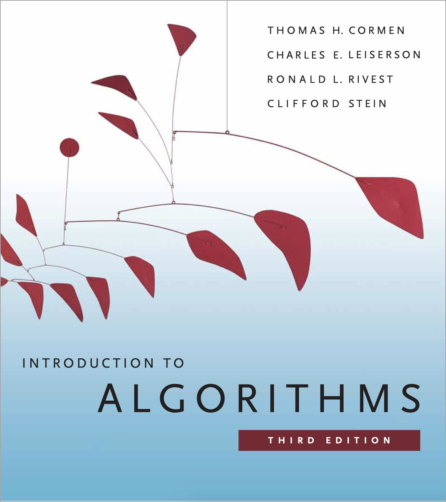

  

  
  
  
  
  

# Solutions to **Introduction to Algorithms** _Third Edition_

## Getting Started

This **[website](https://walkccc.github.io/CLRS/)** contains nearly complete solutions to the bible textbook - [**Introduction to Algorithms** _Third Edition_](https://mitpress.mit.edu/books/introduction-algorithms-third-edition), published by [Thomas H. Cormen](https://mitpress.mit.edu/contributors/thomas-h-cormen), [Charles E. Leiserson](https://mitpress.mit.edu/contributors/charles-e-leiserson), [Ronald L. Rivest](https://mitpress.mit.edu/contributors/ronald-l-rivest), and [Clifford Stein](https://mitpress.mit.edu/contributors/clifford-stein).

Hope to reorganize solutions to help more people and myself study algorithms. By using [Markdown (.md)](https://en.wikipedia.org/wiki/Markdown) files, it's much more readable on portable devices now.

_"Many a little makes a mickle."_

## Contributors

Thanks to:

- The authors of [CLRS Solutions](https://sites.math.rutgers.edu/~ajl213/CLRS/CLRS.html): [Michelle Bodnar](mailto:chellebodnar@gmail.com), who writes the even number problems and [Andrew Lohr](mailto:Andrew.Lohr@gmail.com) who writes the odd number problems.
- [@skanev](https://github.com/skanev), [@CyberZHG](https://github.com/CyberZHG), [@yinyanghu](https://github.com/yinyanghu), etc.

Special thanks to [@JeffreyCA](https://github.com/JeffreyCA), who fixed math rendering on iOS Safari in [#26](https://github.com/walkccc/CLRS/pull/26).

If I miss your name here, please tell me!

I, my friend Tony and [Hsins](https://github.com/hsins) are currently working on removed problems!

## Announcement

The emergence of this website, from the very beginning, is very simple. I want to provide a website that is easy to read on mobile devices to help everyone learning algorithms.

Therefore, please don't hesitate to give me your feedback if any adjustment is needed with the sorted solutions or you have the same motivation and want to contribute to this work. You can press the "pencil icon" in the upper right corner to edit the content or [open an issue](https://github.com/walkccc/CLRS/issues/new) in [my repository](https://github.com/walkccc/CLRS/). Your solution will be rebased on this repository after I review and make some form modification on your pull request.

Thank you very much, and I hope that everyone will learn algorithms smoothly!

## How I generate this website

I use the static site generator [MkDocs](http://www.mkdocs.org/) and the beautiful theme [Material for MkDocs](https://squidfunk.github.io/mkdocs-material/) to build this website!

Since [KaTeX](https://katex.org/) is now supporting more functions and is much faster than [MathJax](https://www.mathjax.org/), I've updated all math equations from MathJax to KaTeX.

I also add `overflow-x: auto` to prevent the overflow issue on small screen devices so that you can scroll horizontally in the math display equations.

## More Informations

I rebased my repository regularly for clearer commit histories. Therefore, if you have forked the repository before, consider reforking it again.

For more information please visit [**my GitHub**](https://github.com/walkccc).

Updated to this new page on April 13, 2018, at 04:48 [(GMT+8)](https://time.is/GMT+8).

Revised on July 21, 2019.

## License

Licensed under the MIT License.
