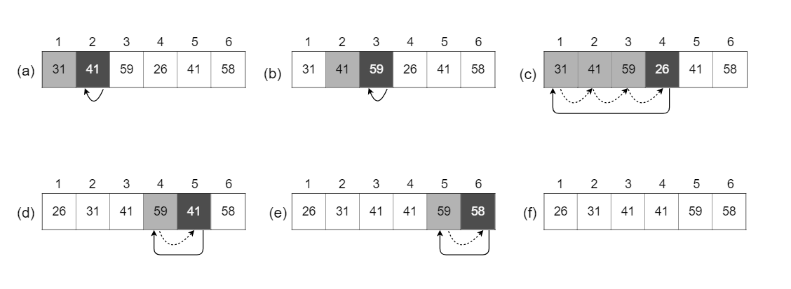

## 2.1-1

> Using Figure 2.2 as a model, illustrate the operation of $\text{INSERTION-SORT}$ on the array $A = \langle 31, 41, 59, 26, 41, 58 \rangle$.



The operation of $\text{INSERTION-SORT}$ on the array $A = \langle 31, 41, 59, 26, 41, 58 \rangle$. Array indices appear above the rectangles, and values stored in the array positions appear within the rectangles.

(a)-(e) are iterations of the for loop of lines 1-8.

In each iteration, the black rectangle holds the key taken from $A[i]$, which is compared with the values in shaded rectangles to its left in the test of line 5. Dotted arrows show array values moved one position to the right in line 6. and solid arrows indicate where the key moves to in line 8.

(f) is the final sorted array.

The changes of array A during traversal:
$$
\begin{aligned}
A & = \langle 31, 41, 59, 26, 41, 58 \rangle \\\\
A & = \langle 31, 41, 59, 26, 41, 58 \rangle \\\\
A & = \langle 31, 41, 59, 26, 41, 58 \rangle \\\\
A & = \langle 26, 31, 41, 59, 41, 58 \rangle \\\\
A & = \langle 26, 31, 41, 41, 59, 58 \rangle \\\\
A & = \langle 26, 31, 41, 41, 58, 59 \rangle
\end{aligned}
$$

## 2.1-2

> Rewrite the $\text{INSERTION-SORT}$ procedure to sort into nonincreasing instead of nondecreasing order.

```cpp
INSERTION-SORT(A)
    for j = 2 to A.length
        key = A[j]
        i = j - 1
        while i > 0 and A[i] < key
            A[i + 1] = A[i]
            i = i - 1
        A[i + 1] = key
```

## 2.1-3

> Consider the **_searching problem_**:
>
> **Input**: A sequence of $n$ numbers $A = \langle a_1, a_2, \ldots, a_n \rangle$ and a value $v$.
>
> **Output:** An index $i$ such that $v = A[i]$ or the special value $\text{NIL}$ if $v$ does not appear in $A$.
>
> Write pseudocode for **_linear search_**, which scans through the sequence, looking for $v$. Using a loop invariant, prove that your algorithm is correct. Make sure that your loop invariant fulfills the three necessary properties.

```cpp
LINEAR-SEARCH(A, v)
    for i = 1 to A.length
       if A[i] == v
            return i
    return NIL
```

**Loop invariant:** At the start of each iteration of the **for** loop, the subarray $A[1..i - 1]$ consists of elements that are different than $v$.

**Initialization:** Before the first loop iteration ($i = 1$), the subarray is the empty array, so the proof is trivial.

**Maintenance:** During each loop iteration, we compare $v$ with $A[i]$. If they are the same, we return $i$, which is the correct result. Otherwise, we continue to the next iteration of the loop. At the end of each loop iteration, we know the subarray $A[1..i]$ does not contain $v$, so the loop invariant holds true. Incrementing $i$ for the next iteration of the **for** loop then preserves the loop invariant.

**Termination:** The loop terminates when $i > A.length = n$. Since $i$ increases by $1$, we must have $i = n + 1$ at that time. Substituting $n + 1$, for $i$ in the wording of the loop invariant, we have that the subarray $A[1..n]$ consists of elements that are different than $v$. Thus, we return $\text{NIL}$. Observing that $A[1..n]$, we conclude that the entire array does not have any element equal to $v$. Hence the algorithm is correct.

## 2.1-4

> Consider the problem of adding two $n$-bit binary integers, stored in two $n$-element arrays $A$ and $B$. The sum of the two integers should be stored in binary form in an $(n + 1)$-element array $C$. State the problem formally and write pseudocode for adding the two integers.

**Input:** An array of booleans $A = \langle a_1, a_2, \ldots, a_n \rangle$ and an array of booleans $B = \langle b_1, b_2, \ldots, b_n \rangle$, each representing an integer stored in binary format (each digit is a number, either $0$ or $1$, **least-significant digit first**) and each of length $n$.

**Output:** An array $C = \langle c_1, c_2, \ldots, c_{n + 1} \rangle$ such that $C' = A' + B'$ where $A'$, $B'$ and $C'$ are the integers, represented by $A$, $B$ and $C$.

```cpp
ADD-BINARY(A, B)
    carry = 0
    for i = 1 to A.length
        sum = A[i] + B[i] + carry
        C[i] = sum % 2  // remainder
        carry = sum / 2 // quotient
    C[A.length + 1] = carry
    return C
```
