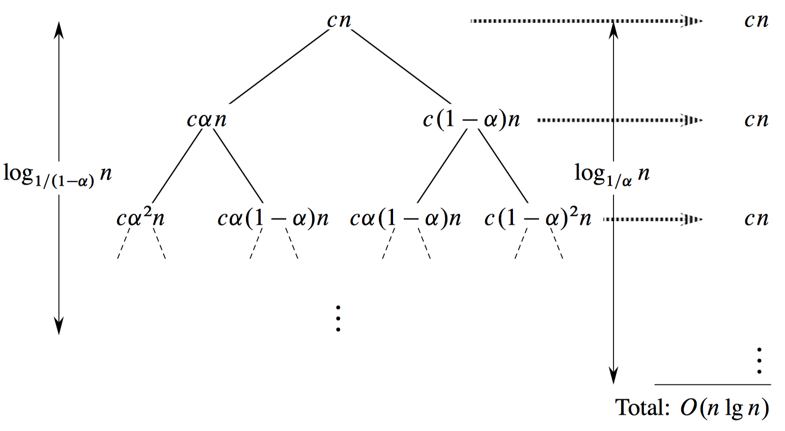

## 4.4-1

> Use a recursion tree to determine a good asymptotic upper bound on the recurrence $T(n) = 3T(\lfloor n / 2 \rfloor) + n$. Use the substitution method to verify your answer.

- The subproblem size for a node at depth $i$ is $n / 2^i$.

    Thus, the tree has $\lg n + 1$ levels and $3^{\lg n} = n^{\lg 3}$ leaves.

    The total cost over all nodes at depth $i$, for $i = 0, 1, 2, \ldots, \lg n - 1$, is $3^i(n / 2^i) = (3 / 2)^i n$.

    $$
    \begin{aligned}
    T(n) & = n + \frac{3}{2}n + \Big(\frac{3}{2}\Big)^2 n + \cdots + \Big(\frac{3}{2}\Big)^{\lg n - 1} n + \Theta(n^{\lg 3}) \\\\
         & = \sum_{i = 0}^{\lg n - 1} \Big(\frac{3}{2}\Big)^i n + \Theta(n^{\lg 3}) \\\\
         & = \frac{(3 / 2)^{\lg n} - 1}{(3 / 2) - 1}n + \Theta(n^{\lg 3}) \\\\
         & = 2[(3 / 2)^{\lg n} - 1]n + \Theta(n^{\lg 3}) \\\\
         & = 2[n^{\lg(3 / 2)} - 1]n + \Theta(n^{\lg 3}) \\\\
         & = 2[n^{\lg 3 - \lg 2} - 1]n + \Theta(n^{\lg 3}) \\\\
         & = 2[n^{\lg 3 - 1 + 1} - n] + \Theta(n^{\lg 3}) \\\\
         & = O(n^{\lg 3}).
    \end{aligned}
    $$

- We guess $T(n) \le cn^{\lg 3} - dn$,

    $$
    \begin{aligned}
    T(n) & =   3T(\lfloor n / 2 \rfloor) + n \\\\
         & \le 3 \cdot (c(n / 2)^{\lg 3} - d(n / 2)) + n \\\\
         & =   (3 / 2^{\lg 3})cn^{\lg 3} - (3d / 2)n + n \\\\
         & =   cn^{\lg 3} + (1 - 3d / 2)n,
    \end{aligned}
    $$

    where the last step holds for $d \ge 2$.

## 4.4-2

> Use a recursion tree to determine a good asymptotic upper bound on the recurrence $T(n) = T(n / 2) + n^2$. Use the substitution method to verify your answer.

- The subproblem size for a node at depth $i$ is $n / 2^i$.

    Thus, the tree has $\lg n + 1$ levels and $1^{\lg n} = 1$ leaf.

    The total cost over all nodes at depth $i$, for $i = 0, 1, 2, \ldots, \lg{n - 1}$, is $1^i (n / 2^i)^2 = (1 / 4)^i n^2$.

    $$
    \begin{aligned}
    T(n) & = \sum_{i = 0}^{\lg n - 1} \Big(\frac{1}{4}\Big)^i n^2 + \Theta(1) \\\\
         & < \sum_{i = 0}^\infty \Big(\frac{1}{4}\Big)^i n^2 + \Theta(1) \\\\
         & = \frac{1}{1 - (1 / 4)} n^2 + \Theta(1) \\\\
         & = \Theta(n^2).
    \end{aligned}
    $$

- We guess $T(n) \le cn^2$,

    $$
    \begin{aligned}
    T(n) & \le c(n / 2)^2 + n^2 \\\\
         & =   cn^2 / 4 + n^2 \\\\
         & =   (c / 4 + 1)n^2 \\\\
         & \le cn^2,
    \end{aligned}
    $$

    where the last step holds for $c \ge 4 / 3$.

## 4.4-3

> Use a recursion tree to determine a good asymptotic upper bound on the recurrence $T(n) = 4T(n / 2 + 2) + n$. Use the substitution method to verify your answer.

- The subproblem size for a node at depth $i$ is $n / 2^i$.

    Thus, the tree has $\lg n + 1$ levels and $4^{\lg n} = n^2$ leaves.

    The total cost over all nodes at depth $i$, for $i = 0, 1, 2, \ldots, \lg n - 1$, is $4^i(n / 2^i + 2) = 2^i n + 2 \cdot 4^i$.

    $$
    \begin{aligned}
    T(n) & = \sum_{i = 0}^{\lg n - 1} (2^i n + 2 \cdot 4^i) + \Theta(n^2) \\\\
         & = \sum_{i = 0}^{\lg n - 1} 2^i n + \sum_{i = 0}^{\lg n - 1} 2 \cdot 4^i + \Theta(n^2) \\\\
         & = \frac{2^{\lg n} - 1}{2 - 1}n + 2 \cdot \frac{4^{\lg n} - 1}{4 - 1} + \Theta(n^2) \\\\
         & = (2^{\lg n} - 1)n + \frac{2}{3} (4^{\lg n} - 1) + \Theta(n^2) \\\\
         & = (n - 1)n + \frac{2}{3}(n^2 - 1) + \Theta(n^2) \\\\
         & = \Theta(n^2).
    \end{aligned}
    $$

- We guess $T(n) \le c(n^2 - dn)$,

    $$
    \begin{aligned}
    T(n) & =   4T(n / 2 + 2) + n \\\\
         & \le 4c[(n / 2 + 2)^2 - d(n / 2 + 2)] + n \\\\
         & =   4c(n^2 / 4 + 2n + 4 - dn / 2 - 2d) + n \\\\
         & =   cn^2 + 8cn + 16c - 2cdn - 8cd + n \\\\
         & =   cn^2 - cdn + 8cn + 16c - cdn - 8cd + n \\\\
         & =   c(n^2 - dn) - (cd - 8c - 1)n - (d - 2) \cdot 8c \\\\
         & \le c(n^2 - dn),
    \end{aligned}
    $$

    where the last step holds for $cd - 8c - 1 \ge 0$.

## 4.4-4

> Use a recursion tree to determine a good asymptotic upper bound on the recurrence $T(n) = 2T(n - 1) + 1$. Use the substitution method to verify your answer.

- The subproblem size for a node at depth $i$ is $n - i$.

    Thus, the tree has $n$ levels and $2^{n - 1}$ leaves.

    The total cost over all nodes at depth $i$, for $i = 0, 1, 2, \ldots, n - 1$, is $2^i$.

    $$
    \begin{aligned}
    T(n) & = \sum_{i = 0}^{n - 1} 2^i \\\\
         & = \frac{2^{n - 1} - 1}{2 - 1} \\\\
         & = 2^{n - 1} - 1 \\\\
         & = \Theta(2^n).
    \end{aligned}
    $$

- We guess $T(n) \le c2^n + n$,

    $$
    \begin{aligned}
    T(n) & \le 2 \cdot c2^{n - 1} + (n - 1) + 1 \\\\
         & =   c2^n + n \\\\
         & =   O(2^n).
    \end{aligned}
    $$

## 4.4-5

> Use a recursion tree to determine a good asymptotic upper bound on the recurrence $T(n) = T(n - 1) + T(n / 2) + n$. Use the substitution method to verify your answer.

This is a curious one. The tree makes it look like it is exponential in the worst case. The tree is not full (not a complete binary tree of height $n$), but it is not polynomial either. It's easy to show $O(2^n)$ and $\Omega(n^2)$.

To justify that this is a pretty tight upper bound, we'll show that we can't have any other choice. If we have that $T(n) \le cn^k$, when we substitue into the recurrence, the new coefficient for $n^k$ can be as high as $c(1 + \frac{1}{2^k})$ which is bigger than $c$ regardless of how we choose the value $c$.

- We guess $T(n) \le c2^n - 4n$,

    $$
    \begin{aligned}
    T(n) & \le c2^{n - 1} - 4(n - 1) + c2^{n / 2} - 4n / 2 + n \\\\
         & =   c(2^{n - 1} + 2^{n / 2}) - 5n + 4 & (n \ge 1 / 4) \\\\
         & \le c(2^{n - 1} + 2^{n / 2}) - 4n & (n \ge 2)\\\\
         & =   c(2^{n - 1} + 2^{n - 1}) - 4n \\\\
         & \le c2^n - 4n \\\\ & = O(2^n).
    \end{aligned}
    $$

- We guess $T(n) \ge cn^2$,

    $$
    \begin{aligned}
    T(n) & \ge c(n - 1)^2 + c(n / 2)^2 + n \\\\
         & =   cn^2 - 2cn + c + cn^2 / 4 + n \\\\
         & =   (5 / 4)cn^2 + (1 - 2c)n + c \\\\
         & \ge cn^2 + (1 - 2c)n + c & (c \le 1 / 2) \\\\
         & \ge cn^2 \\\\
         & =   O(n^2).
    \end{aligned}
    $$

## 4.4-6

> Argue that the solution to the recurrence $T(n) = T(n / 3) + T(2n / 3) + cn$, where $c$ is a constant, is $\Omega(n\lg n)$ by appealing to the recursion tree.

The shortest path from the root to a leaf in the recursion tree is $n \to (1 / 3)n \to (1 / 3)^2 n \to \cdots \to 1$. Since $(1 / 3)^k n = 1$ when $k = \log_3 n$, the height of the part of the tree in which every node has two children is $log_3 n$. Since the values at each of these levels of the tree add up to $n$, the solution to the recurrence is at least $n \log_3 n$ = $\Omega(n\lg n)$.

## 4.4-7

> Draw the recursion tree for $T(n) = 4T(\lfloor n / 2 \rfloor) + cn$, where $c$ is a constant, and provide a tight asymptotic bound on its solution. Verify your answer with the substitution method.

- The subproblem size for a node at depth $i$ is $n / 2^i$.

    Thus, the tree has $\lg n + 1$ levels and $4^{\lg n} = n^{\lg 4} = n^2$ leaves.

    The total cost over all nodes at depth $i$, for $i = 0, 1, 2, \ldots, \lg n - 1$, is $4^i(cn / 2^i) = 2^icn$.

    $$
    \begin{aligned}
    T(n) & = \sum_{i = 0}^{\lg n - 1} 2^icn + \Theta(n^2) \\\\
         & = \frac{2^{\lg n} - 1}{2 - 1}cn + \Theta(n^2) \\\\
         & = \Theta(n^2).
    \end{aligned}
    $$

- For $O(n^2)$, we guess $T(n) \le cn^2 + 2cn$,

    $$
    \begin{aligned}
    T(n) & \le 4c(n / 2)^2 + 2c(n / 2) + cn \\\\
         & =   cn^2 + 2cn.
    \end{aligned}
    $$

- For $\Omega(n^2)$, we guess $T(n) \ge cn^2 + 2cn$,

    $$
    \begin{aligned}
    T(n) & \ge 4c(n / 2)^2 + 2c(n / 2) + cn \\\\
         & =   cn^2 + 2cn.
    \end{aligned}
    $$

## 4.4-8

> Use a recursion tree to give an asymptotically tight solution to the recurrence $T(n) = T(n - a) + T(a) + cn$, where $a \ge 1$ and $c > 0$ are constants.

- The tree has $n / a + 1$ levels.

    The total cost over all nodes at depth $i$, for $i = 0, 1, 2, \ldots, n / a - 1$, is $c(n - ia)$.

    $$
    \begin{aligned}
    T(n) & = \sum_{i = 0}^{n / a} c(n - ia) + (n / a)ca \\\\
         & = \sum_{i = 0}^{n / a} cn - \sum_{i = 0}^{n / a} cia + (n / a)ca \\\\
         & = cn^2/a - \Theta(n) + \Theta(n) \\\\
         & = \Theta(n^2).
    \end{aligned}
    $$

- For $O(n^2)$, we guess $T(n) \le cn^2$,

    $$
    \begin{aligned}
    T(n) & \le c(n - a)^2 + ca + cn \\\\
         & \le cn^2 - 2can + ca + cn \\\\
         & \le cn^2 - c(2an - a - n) & (a > 1 / 2, n > 2a) \\\\
         & \le cn^2 - cn \\\\
         & \le cn^2 \\\\
         & =   \Theta(n^2).
    \end{aligned}
    $$

- For $\Omega(n^2)$, we guess $T(n) \ge cn^2$,

    $$
    \begin{aligned}
    T(n) & \ge c(n - a)^2 + ca + cn \\\\
         & \ge cn^2 - 2acn + ca + cn \\\\
         & \ge cn^2 - c(2an - a - n) & (a < 1 / 2, n > 2a) \\\\
         & \ge cn^2 + cn \\\\
         & \ge cn^2 \\\\
         & =   \Theta(n^2).
    \end{aligned}
    $$

## 4.4-9

> Use a recursion tree to give an asymptotically tight solution to the recurrence $T(n) = T(\alpha n) + T((1 - \alpha)n) + cn$, where $\alpha$ is a constant in the range $0 < \alpha < 1$, and $c > 0$ is also a constant.

$$T(n) = T(\alpha n) + T((1 - \alpha)n) + cn$$

We saw the solution to the recurrence $T(n) = T(n / 3) + T(2n / 3) + cn$ in the text. This recurrence can be similarly solved.

Without loss of generality, let $\alpha \ge 1 - \alpha$, so that $0 < 1 - \alpha \le 1 / 2$ and $1 / 2 \le \alpha < 1$.

The recursion tree is full for $\log_{1 / (1 - \alpha)} n$ levels, each contributing $cn$, so we guess

$$\Omega(n\log_{1 / (1 - \alpha)} n) = \Omega(n\lg n).$$

It has $\log_{1 / \alpha} n$ levels, each contributing $\le cn$, so we guess

$$O(n\log_{1 / \alpha} n) = O(n\lg n).$$

Now we show that $T(n) = \Theta(n\lg n)$ by substitution. To prove the upper bound, we need to show that $T(n) \le dn\lg n$ for a suitable constant $d > 0$.

$$
\begin{aligned}
T(n) & =   T(\alpha n) + T((1 - \alpha)n) + cn \\\\
     & \le d\alpha n\lg(\alpha n) + d(1 - \alpha)n\lg((1 - \alpha)n) + cn \\\\
     & =   d\alpha n\lg\alpha + d\alpha n\lg n + d(1 - \alpha)n\lg(1 - \alpha) + d(1 - \alpha)n\lg n + cn \\\\
     & =   dn\lg n + dn(\alpha \lg\alpha + (1 - \alpha) \lg(1 - \alpha)) + cn \\\\
     & \le dn\lg n,
\end{aligned}
$$

if $dn(\alpha \lg\alpha + (1 - \alpha) \lg(1 - \alpha)) + cn \le 0$. This condition is equivalent

$$d(\alpha \lg\alpha + (1 - \alpha) \lg(1 - \alpha)) \le -c.$$

Since $1 / 2 \le \alpha < 1$ and $0 < 1 - \alpha \le 1 / 2$, we have that $\lg\alpha < 0$ and $\lg(1 - \alpha ) < 0$. Thus, $\alpha \lg\alpha + (1 - \alpha ) \lg(1 - \alpha ) < 0$, so that when we multiply both sides of the inequality by this factor, we need to reverse the inequality:

$$d \ge \frac{-c}{\alpha\lg\alpha + (1 - \alpha)\lg(1 - \alpha)}$$

or

$$d \ge \frac{c}{-\alpha\lg\alpha + -(1 - \alpha)\lg(1 - \alpha)}.$$

The fraction on the right-hand side is a positive constant, and so it suffices to pick any value of $d$ that is greater than or equal to this fraction.

To prove the lower bound, we need to show that $T(n) \ge dn\lg n$ for a suitable constant $d > 0$. We can use the same proof as for the upper bound, substituting $\ge$ for $\le$, and we get the requirement that

$$0 < d \le \frac{c}{-\alpha \lg\alpha - (1 - \alpha ) \lg(1 - \alpha )}.$$

Therefore, $T(n) = \Theta(n\lg n)$.
