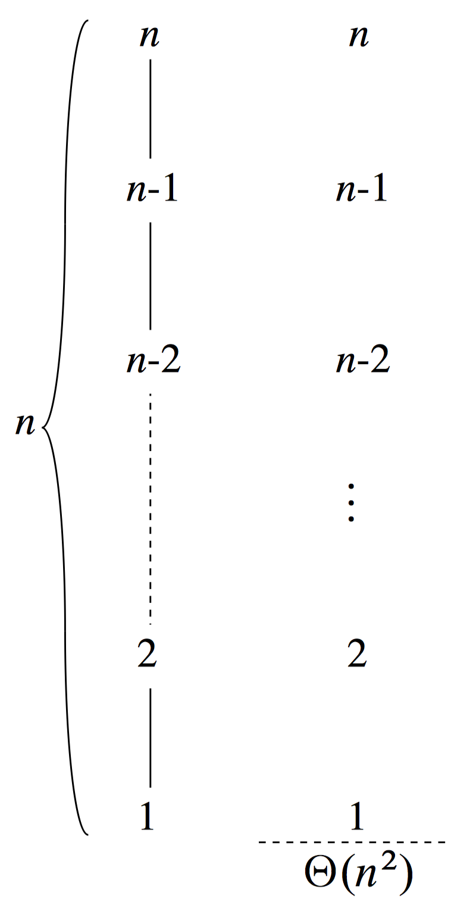

> Give asymptotic upper and lower bound for $T(n)$ in each of the following recurrences. Assume that $T(n)$ is constant for $n \le 2$. Make your bounds as tight as possible, and justify your answers.
>
> **a.** $T(n) = 2T(n / 2) + n^4$.
>
> **b.** $T(n) = T(7n / 10) + n$.
>
> **c.** $T(n) = 16T(n / 4) + n^2$.
>
> **d.** $T(n) = 7T(n / 3) + n^2$.
>
> **e.** $T(n) = 7T(n / 2) + n^2$.
>
> **f.** $T(n) = 2T(n / 4) + \sqrt n$.
>
> **g.** $T(n) = T(n - 2) + n^2$.

Note: In parts (a), (b), and (d) below, we are applying case 3 or the master theorem, which requires the regularity condition that $af(n / b) \le cf(n)$ for some constant $c < 1$. In each of these parts, $f(n)$ has the form $n^k$. The regularity condition is satisfied because

$$af(n / b) = an^k / b^k = (a / b^k) n^k = (a / b^k)f(n),$$

and in each of the cases below, $a / b^k$ is a constant strctly less than $1$.

**a.** $T(n) = 2T(n / 2) + n^4 = \Theta(n^4)$. This is a divide-and-conquer recurrence with $a = 2$, $b = 2$, $f(n) = n^4$, and $n^{\log_b a} = n^{\lg 2} = n$. Since $n^4 = \Omega(n^{\lg 2 + 3})$ and $a / b^k = 2 / 2^4 = 1 / 8 < 1$, case 3 of the master theorem applies, and $T(n) = \Theta(n^4)$.

**b.** $T(n) = T(7n / 10) + n = \Theta(n)$. This is a divide-and-conquer recurrence with $a = 1$, $b = 10 / 7$, $f(n) = n$, and $n^{\log_b a} = n^{\log_{10 / 7} 1} = n^0 = 1$. Since $n = \Omega(n^{\log_{10 / 7} 1 + 1})$ and $a / b^k = 1 / (10 / 7)^1 = 7 / 10 < 1$, case 3 of the master theorem applies, and $T(n) = \Theta(n)$.

**c.** $T(n) = 16T(n / 4) + n^2 = \Theta(n^2 \lg n)$. This is another divide-and-conquer recurrence with $a = 16$, $b = 4$, $f(n) = n^2$, and $n^{\log_b a} = n^{\log_4 16} = n^2$. Since $n^2 = \Theta(n^{\log_4 16})$, case 2 of the master theorem applies, and $T(n) = \Theta(n^2 \lg n)$.

**d.** $T(n) = 7T(n / 3) + n^2 = \Theta(n^2)$. This is a divide-and-conquer recurrence with $a = 7$, $b = 3$, $f(n) = n^2$, and $n^{\log_b a} = n^{\log_3 7}$. Since $1 < \log_3 7 < 2$, we have that $n^2 = \Omega(n^{\log_3 7 + \epsilon})$ for some constant $\epsilon > 0$. We also have $a / b^k = 7 / 3^2 = 7 / 9 < 1$, so that case 3 of the master theorem applies, and $T(n) = \Theta(n^2)$.

**e.** $T(n) = 7T(n / 2) + n^2 = O(n^{\lg 7})$. This is a divide-and-conquer recurrence with $a = 7$, $b = 2$, $f(n) = n^2$, and $n^{\log_b a} = n^{\lg 7}$. Since $2 < \lg 7 < 3$, we have that $n^2 = O(n^{\lg 7 - \epsilon})$ for some constant $\epsilon > 0$. Thus case 1 of the master theorem applies, and $T(n) = \Theta(n^{\lg 7})$.

**f.** $T(n) = 2T(n / 4) + \sqrt n = \Theta(\sqrt n\lg n)$. This is another divide-and-conquer recurrence with $a = 2$, $b = 4$, $f(n) = \sqrt n$, and $n^{\log_b a} = n^{\log_4 2} = \sqrt n$. Since $\sqrt n = \Theta(n^{\log_4 2})$, case 2 of the master theorem applies, and $T(n) = \Theta(\sqrt n\lg n)$.

**g.** $T(n) = T(n - 1) + n$  
Using the recursion tree shown below, we get a guess of $T(n) = \Theta(n^2)$.

First, we prove the $T(n) = \Omega(n^2)$ part by induction. The inductive hypothesis is $T(n) \ge cn^2$ for some constant $c > 0$.

$$
\begin{aligned}
T(n) & =   T(n - 1) + n \\\\
     & \ge c(n - 1)^2 + n \\\\
     & =   cn^2 - 2cn + c + n \\\\
     & \ge cn^2,
\end{aligned}
$$

if $-2cn + n + c \ge 0$ or, equivalently, $n(1 - 2c) + c \ge 0$. This condition holds when $n \ge 0$ and $0 < c \le 1 / 2$.

For the upper bound, $T(n) = O(n^2)$, we use the inductive hypothesis that $T(n) \le cn^2$ for some constant $c > 0$. By a similar derivation, we get that $T(n) \le cn^2$ if $-2cn + n + c \le 0$ or, equivalently, $n(1 - 2c) + c \le 0$. This condition holds for $c = 1$ and $n \ge 1$.

Thus, $T(n) = \Omega(n^2)$ and $T(n) = O(n^2)$, so we conclude that $T(n) = \Theta(n^2)$.

**h.** $T(n) = T(\sqrt n) + 1$

The easy way to do this is with a change of variables, as on page 86 of the text. Let $m = \lg n$ and $S(m) = T(2^m)$. $T(2^m) = T(2^{m / 2}) + 1$, so $S(m) = S(m / 2) + 1$. Using the master theorem, $n^{\log_b a} = n^{\lg 1} = n^0 = 1$ and $f(n) = 1$. Since $1 = \Theta(1)$, case 2 applies and $S(m) = \Theta(\lg m)$. Therefore, $T(n) = \Theta(\lg\lg n)$.
