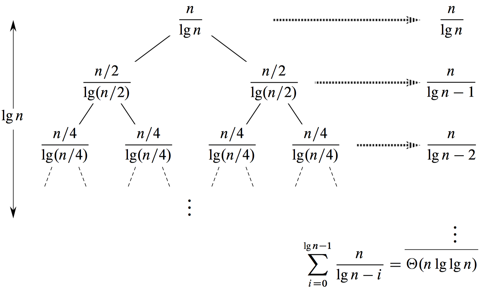
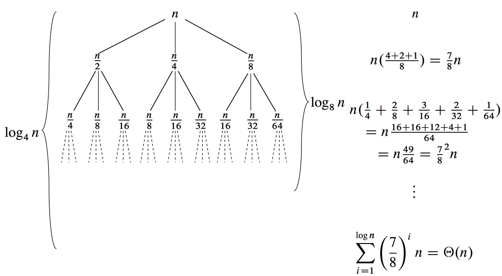

> Give asymptotic upper and lower bounds for $T(n)$ in each of the following recurrences. Assume that $T(n)$ is constant for sufficiently small $n$. Make your bounds as tight as possible, and justify your answers.
>
> **a.** $T(n) = 4T(n / 3) + n\lg n$.
>
> **b.** $T(n) = 3T(n / 3) + n / \lg n$.
>
> **c.** $T(n) = 4T(n / 2) + n^2\sqrt n$.
>
> **d.** $T(n) = 3T(n / 3 - 2) + n / 2$.
>
> **e.** $T(n) = 2T(n / 2) + n / \lg n$.
>
> **f.** $T(n) = T(n / 2) + T(n / 4) + T(n / 8) + n$.
>
> **g.** $T(n) = T(n - 1) + 1 / n$.
>
> **h.** $T(n) = T(n - 1) + \lg n$.
>
> **i.** $T(n) = T(n - 2) + 1 / \lg n$.
>
> **j.** $T(n) = \sqrt nT(\sqrt n) + n$

_[This problem is solved only for parts a, c, e, f, g, h, and i.]_

**a.** $T(n) = 3T(n / 2) + n\lg n$  
We have $f(n) = n\lg n$ and $n^{\log_b a} = n^{\lg 3} \approx n^{1.585}$. Since $n\lg n = O(n^{\lg 3 - \epsilon})$ for any $0 < \epsilon \le 0.58$, by case 1 of the master theorem, we have $T(n) = \Theta(n^{\lg 3})$.

**b.** $\Theta(n\lg\lg n)$. Check subtask 5 for the reasoning.

**c.** $T(n) = 4T(n / 2) + n^2 \sqrt n$  
We have $f(n) = n^2 \sqrt n = n^{5 / 2}$ and $n^{\log_b a} = n^{\lg 4} = n^2$. Since $n^{5 / 2} = \Omega(n^{2 + \epsilon})$ for $\epsilon = 1 / 2$, we look at the regularity condition in case 3 of the master theorem. We have

$$af(n / b) = 4(n / 2)^2 \sqrt{n / 2} = n^{5 / 2} / \sqrt 2 \le cn^{5 / 2}$$

for $1 / \sqrt 2 \le c < 1$. Case 3 applies, and we have $T(n) = \Theta(n^2 \sqrt n)$.

**d.** $\Theta(n\lg n)$ by the master method.

**e.** $T(n) = 2T(n / 2) + n / \lg n$

We can get a guess by means of a recursion tree:

We get the sum on each level by observing that at depth $i$, we have $2^i$ nodes, each with a numerator of $n / 2^i$ and a denominator of $\lg(n / 2^i) = \lg n - i$, so that the cost at depth $i$ is

$$2^i \cdot \frac{n / 2^i}{\lg n - i} = \frac{n}{\lg n - i}.$$

The sum for all levels is

$$
\begin{aligned}
\sum_{i = 0}^{\lg n - 1} \frac{n}{\lg n - i}
    & = \sum_{i = 1}^{\lg n} \frac{n}{i} \\\\
    & = n \sum_{i = 1}^{\lg n} 1 / i \\\\
    & = n \cdot \Theta(\lg\lg n) & \text{(by equation (A.7), the harmonic series)} \\\\
    & = \Theta(n\lg\lg n).
\end{aligned}
$$

We can use this analysis as a guess that $T(n) = \Theta(n\lg\lg n)$. If we were to do a straight substitution proof, it would be rather involved. Instead, we will show by substitution that $T(n) \le n(1 + H_{\lfloor \lg n \rfloor})$ and $T(n) \ge n \cdot H_{\lceil \lg n \rceil}$, where $H_k$ is the $k$th harmonic number: $H_k = 1 / 1 + 1 / 2 + 1 / 3 + \cdots + 1 / k$. We also define $H_0 = 0$. Since $H_k = \Theta(\lg k)$, we have that $H_{\lfloor \lg n \rfloor} = \Theta(\lg \lfloor \lg n \rfloor) = \Theta(\lg\lg n)$ and $H_{\lceil \lg n \rceil} = \Theta(\lg \lceil \lg n \rceil) = \Theta(\lg\lg n)$. Thus, we will have that $T(n) = \Theta(n\lg\lg n)$.

The base case for the proof is for $n = 1$, and we use $T(1) = 1$. Here, $\lg n = 0$, so that $\lg n = \lfloor \lg n \rfloor = \lceil \lg n \rceil$. Since $H_0 = 0$, we have $T(1) = 1 \le 1(1 + H_0)$ and $T(1) = 1 \ge 0 = 1 \cdot H_0$.

For the upper bound of $T(n) \le n(1 + H_{\lfloor \lg n \rfloor})$, we have

$$
\begin{aligned}
T(n) & =   2T(n / 2) + n / \lg n \\\\
     & \le 2((n / 2)(1 + H_{\lfloor \lg (n / 2) \rfloor})) + n / \lg n \\\\
     & =   n(1 + H_{\lfloor \lg n - 1 \rfloor}) + n / \lg n \\\\
     & =   n(1 + H_{\lfloor \lg n \rfloor - 1} + 1 / \lg n) \\\\
     & \le n(1 + H_{\lfloor \lg n \rfloor - 1} + 1 / \lfloor \lg n \rfloor) \\\\
     & =   n(1 + H_{\lfloor \lg n \rfloor}),
\end{aligned}
$$

where the last line follows from the identity $H_k = H_{k - 1} + 1 / k$.

The upper bound of $T(n) \ge n \cdot H_{\lceil \lg n \rceil}$ is similar:

$$
\begin{aligned}
T(n) & =   2T(n / 2) + n / \lg n \\\\
     & \ge 2((n / 2) \cdot H_{\lceil \lg (n / 2) \rceil}) + n / \lg n \\\\
     & =   n \cdot (H_{\lceil \lg n - 1 \rceil}) + n / \lg n \\\\
     & =   n \cdot (H_{\lceil \lg n \rceil - 1} + 1 / \lg n) \\\\
     & \ge n \cdot (H_{\lceil \lg n \rceil - 1} + 1 / \lceil \lg n \rceil) \\\\
     & =   n \cdot (H_{\lceil \lg n \rceil}).
\end{aligned}
$$

Thus, $T(n) = \Theta(n\lg\lg n)$.

**f.** $T(n) = T(n / 2) + T(n / 4) + T(n / 8) + n$

Using the recursion tree shown below, we get a guess of $T(n) = \Theta(n)$.

We use the substitution method to prove that $T(n) = O(n)$. Our inductive hypothesis is that $T(n) \le cn$ for some constant $c > 0$. We have

$$
\begin{aligned}
T(n) & =   T(n / 2) + T(n / 4) + T(n / 8) + n \\\\
     & \le cn / 2 + cn / 4 + cn / 8 + n \\\\
     & =   7 cn / 8 + n \\\\
     & =   (1 + 7c / 8) n \\\\
     & \le cn \quad \text{if $c \ge 8$}.
\end{aligned}
$$

Therefore, $T(n) = O(n)$.

Showing that $T(n) = \Omega(n)$ is easy:

$$T(n) = T(n / 2) + T(n / 4) + T(n / 8) + n \ge n.$$

Since $T(n) = O(n)$ and $T(n) = \Omega(n)$, we have that $T(n) = \Theta(n)$.

**g.** $T(n) = T(n - 1) + 1 / n$

This recurrence corresponds to the harmonic series, so that $T(n) = H_n$, where $H_n = 1 / 1 + 1 / 2 + 1 / 3 + \cdots + 1 / n$. For the base case, we have $T(1) = 1 = H_1$. For the inductive step, we assume that $T(n - 1) = H_{n - 1}$, and we have

$$
\begin{aligned}
T(n) & = T(n - 1) + 1 / n \\\\
     & = H_{n - 1} + 1 / n \\\\
     & = H_n.
\end{aligned}
$$

Since $H_n = \Theta(\lg n)$ by equation $\text{(A.7)}$, we have that $T(n) = \Theta(\lg n)$.

**h.** $T(n) = T(n - 1) + \lg n$

We guess that $T(n) = \Theta(n\lg n)$. To prove the upper bound, we will show that $T(n) = O(n\lg n)$. Our inductive hypothesis is that $T(n) \le cn\lg n$ for some constant $c$. We have

$$
\begin{aligned}
T(n) & =   T(n - 1) + \lg n \\\\
     & \le c(n - 1) \lg(n - 1) + \lg n \\\\
     & =   cn\lg(n - 1) - c \lg(n - 1) + \lg n \\\\
     & \le cn\lg(n - 1) - c \lg(n / 2) + \lg n & \text{(since $\lg(n - 1) \ge \lg(n / 2)$ for $n \ge 2$)} \\\\
     & =   cn\lg(n - 1) - c \lg n + c + \lg n \\\\
     & <   cn\lg n - c \lg n + c + \lg n \\\\
     & \le cn\lg n,
\end{aligned}
$$

if $-c \lg n + c + \lg n \le 0$. Equivalently,

$$
\begin{aligned}
-c \lg n + c + \lg n & \le 0 \\\\
                   c & \le (c - 1) \lg n \\\\
               \lg n & \ge c / (c - 1).
\end{aligned}
$$

This works for $c = 2$ and all $n \ge 4$.

To prove the lower bound, we will show that $T(n) = \Omega(n\lg n)$. Our inductive hypothesis is that $T(n) \ge cn\lg n + dn$ for constants $c$ and $d$. We have

$$
\begin{aligned}
T(n) & =   T(n - 1) + \lg n \\\\
     & \ge c(n - 1) \lg(n - 1) + d(n - 1) + \lg n \\\\
     & =   cn\lg(n - 1) - c \lg(n - 1) + dn - d + \lg n \\\\
     & \ge cn\lg(n / 2) - c \lg(n - 1) + dn - d + \lg n & \text{(since $\lg(n - 1) \ge \lg(n / 2)$ for $n \ge 2$)} \\\\
     & =   cn\lg n - cn - c \lg(n - 1) + dn - d + \lg n \\\\
     & \ge cn\lg n,
\end{aligned}
$$

if $-cn - c \lg(n - 1) + dn - d + \lg n \ge 0$. Since

$$-cn - c \lg(n - 1) + dn - d + \lg n > -cn - c\lg(n - 1) + dn - d + \lg(n - 1),$$

it suffices to find conditions in which $-cn - c\lg(n - 1) + dn - d + \lg(n - 1) \ge 0$. Equivalently,

$$
\begin{aligned}
-cn - c \lg(n - 1) + dn - d + \lg(n - 1) & \ge 0 \\\\
                                (d - c)n & \ge (c - 1)\lg(n - 1) + d.
\end{aligned}
$$

This works for $c = 1$, $d = 2$, and all $n \ge 2$.

Since $T(n) = O(n\lg n)$ and $T(n) = \Omega(n\lg n)$, we conclude that $T(n) = \Theta(n\lg n)$.

**i.** $T(n) = T(n - 2) + 2\lg n$

We guess that $T(n) = \Theta(n\lg n)$. We show the upper bound of $T(n) = O(n\lg n)$ by means of the inductive hypothesis $T(n) \le cn\lg n$ for some constant $c > 0$. We have

$$
\begin{aligned}
T(n) & =   T(n - 2) + 2\lg n \\\\
     & \le c(n - 2)\lg(n - 2) + 2\lg n \\\\
     & \le c(n - 2)\lg n + 2\lg n \\\\
     & =   (cn - 2c + 2)\lg n \\\\
     & =   cn\lg n + (2 - 2c)\lg n \\\\
     & \le cn\lg n & \text{if $c > 1$}.
\end{aligned}
$$

Therefore, $T(n) = O(n\lg n)$.

For the lower bound of $T(n) = \Omega(n\lg n)$, we'll show that $T(n) \ge cn\lg n + dn$, for constants $c, d > 0$ to be chosen. We assume that $n \ge 4$, which implies that

1. $\lg(n - 2) \ge \lg(n / 2)$,
2. $n / 2 \ge \lg n$, and
3. $n / 2 \ge 2$.

(We'll use these inequalities as we go along.) We have

$$
\begin{aligned}
T(n) & \ge c(n - 2)\lg(n - 2) + d(n - 2) + 2\lg n \\\\
     & =   cn\lg(n - 2) - 2c\lg(n - 2) + dn - 2d + 2\lg n \\\\
     & >   cn\lg(n - 2) - 2c\lg n + dn - 2d + 2\lg n & \text{(since $-\lg n < -\lg(n - 2)$)} \\\\
     & =   cn\lg(n - 2) - 2(c - 1)\lg n + dn - 2d & \text{(by inequality (1) above)} \\\\
     & =   cn\lg n - cn - 2(c - 1)\lg n + dn - 2d \\\\
     & \ge cn\lg n,
\end{aligned}
$$

if $-cn - 2(c - 1)\lg n + dn - 2d \ge 0$ or, equivalently, $dn \ge cn + 2(c - 1)\lg n + 2d$. Pick any constant $c > 1 / 2$, and then pick any constant $d$ such that

$$d \ge 2(2c - 1).$$

(The requirement that $c > 1 / 2$ means that $d$ is positive.) Then

$$d / 2 \ge 2c - 1 = c + (c - 1),$$

and adding $d / 2$ to both sides, we have

$$d \ge c + (c - 1) + d / 2.$$

Multiplying by $n$ yields

$$dn \ge cn + (c - 1)n + dn / 2,$$

and then both multiplying and dividing the middle term by $2$ gives

$$dn \ge cn + 2(c - 1)n / 2 + dn / 2.$$

Using inequalities (2) and (3) above, we get

$$dn \ge cn + 2(c - 1)\lg n + 2d,$$

which is what we needed to show. Thus $T(n) = \Omega(n\lg n)$. Since $T(n) = O(n\lg n)$ and $T(n) = \Omega(n\lg n)$, we conclude that $T(n) = \Theta(n\lg n)$.

**j.** $T(n) = \sqrt nT(\sqrt n) + n$

We guess $T(n) \le cn\lg\lg n$,

$$
\begin{aligned}
T(n) & \le \sqrt nc\sqrt n\lg\lg\sqrt n + n \\\\
     & =   cn\lg\lg\sqrt n + n \\\\
     & =   cn\lg\frac{\lg n}{2} + n \\\\
     & =   cn\lg\lg n - cn\lg 2 + n \\\\
     & =   cn\lg\lg n + (1 - c)n & (c > 1) \\\\
     & \le cn\lg\lg n. & = \Theta(n\lg\lg n)
\end{aligned}
$$
