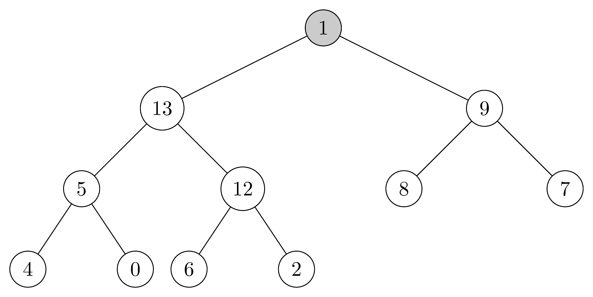
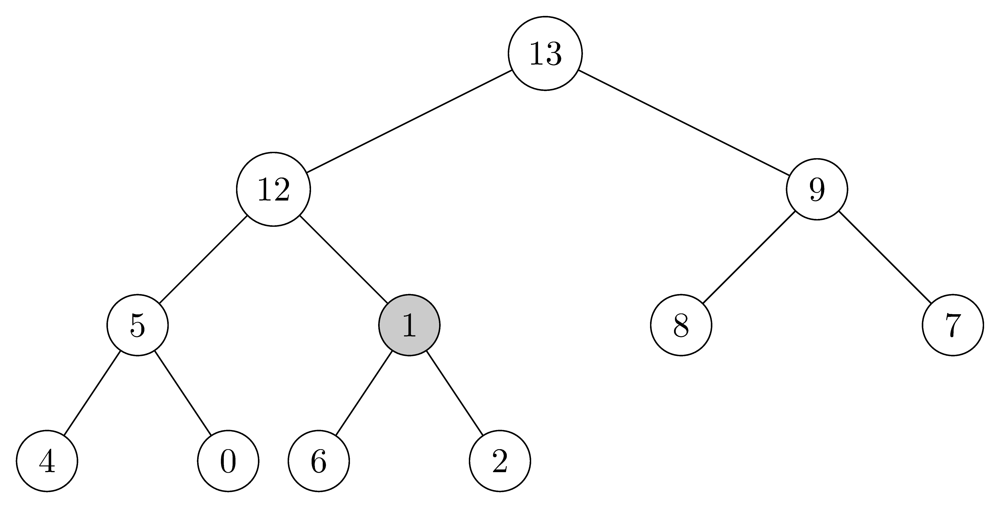

## 6.5-1

> Illustrate the operation $\text{HEAP-EXTRACT-MAX}$ on the heap $A = \langle 15, 13, 9, 5, 12, 8, 7, 4, 0, 6, 2, 1 \rangle$.

1. Original heap.

    

2. Extract the max node $15$, then move $1$ to the top of the heap.

    

3. Since $13 > 9 > 1$, swap $1$ and $13$.

    

4. Since $12 > 5 > 1$, swap $1$ and $12$.

    

5. Since $6 > 2 > 1$, swap $1$ and $6$.

    

## 6.5-2

> Illustrate the operation of $\text{MAX-HEAP-INSERT}(A, 10)$ on the heap $A = \langle 15, 13, 9, 5, 12, 8, 7, 4, 0, 6, 2, 1 \rangle$.

1. Original heap.

    

2. Since $\text{MAX-HEAP-INSERT}(A, 10)$ is called, we append a node assigned value $-\infty$.

    

3. Update the $key$ value of the new node.

    

4. Since the parent $key$ is smaller than $10$, the nodes are swapped.

    

5. Since the parent $key$ is smaller than $10$, the nodes are swapped.

    

## 6.5-3

> Write pseudocode for the procedures $\text{HEAP-MINIMUM}$, $\text{HEAP-EXTRACT-MIN}$, $\text{HEAP-DECREASE-KEY}$, and $\text{MIN-HEAP-INSERT}$ that implement a min-priority queue with a min-heap.

```cpp
HEAP-MINIMUM(A)
    return A[1]
```

```cpp
HEAP-EXTRACT-MIN(A)
    if A.heap-size < 1
        error "heap underflow"
    min = A[1]
    A[1] = A[A.heap-size]
    A.heap-size = A.heap-size - 1
    MIN-HEAPIFY(A, 1)
    return min
```

```cpp
HEAP-DECREASE-KEY(A, i, key)
    if key > A[i]
        error "new key is larger than current key"
    A[i] = key
    while i > 1 and A[PAREANT(i)] > A[i]
        exchange A[i] with A[PARENT(i)]
        i = PARENT(i)
```

```cpp
MIN-HEAP-INSERT(A, key)
    A.heap-size = A.heap-size + 1
    A[A.heap-size] = ∞
    HEAP-DECREASE-KEY(A, A.heap-size, key)
```

## 6.5-4

> Why do we bother setting the key of the inserted node to $-\infty$ in line 2 of $\text{MAX-HEAP-INSERT}$ when the next thing we do is increase its key to the desired value?

In order to pass the guard clause. Otherwise we have to drop the check if $key < A[i]$.

## 6.5-5

> Argue the correctness of $\text{HEAP-INCREASE-KEY}$ using the following loop invariant:
>
> At the start of each iteration of the **while** loop of lines 4-6, the subarray $A[1 ..A.heap\text-size]$ satisfies the max-heap property, except that there may be one violation: $A[i]$ may be larger than $A[\text{PARENT}(i)]$.
>
> You may assume that the subarray $A[1..A.heap\text-size]$ satisfies the max-heap property at the time $\text{HEAP-INCREASE-KEY}$ is called.

**Initialization:** $A$ is a heap except that $A[i]$ might be larger that it's parent, because it has been modified. $A[i]$ is larger than its children, because otherwise the guard clause would fail and the loop will not be entered (the new value is larger than the old value and the old value is larger than the children).

**Maintenance:** When we exchange $A[i]$ with its parent, the max-heap property is satisfied except that now $A[\text{PARENT}(i)]$ might be larger than its parent. Changing $i$ to its parent maintains the invariant.

**Termination:** The loop terminates whenever the heap is exhausted or the max-heap property for $A[i]$ and its parent is preserved. At the loop termination, $A$ is a max-heap.

## 6.5-6

> Each exchange operation on line 5 of $\text{HEAP-INCREASE-KEY}$ typically requires three assignments. Show how to use the idea of the inner loop of $\text{INSERTION-SORT}$ to reduce the three assignments down to just one assignment.

Change the procedure to the following:

```cpp
HEAP-INCREASE-KEY(A, i, key)
    if key < A[i]
        error "new key is smaller than current key"
    while i > 1 and A[PARENT(i)] < key
        A[i] = A[PARENT(i)]
        i = PARENT(i)
    A[i] = key
```

## 6.5-7

> Show how to implement a first-in, first-out queue with a priority queue. Show how to implement a stack with a priority queue. (Queues and stacks are defined in section 10.1).

Both are simple. For a stack we keep adding elements in increasing priority, while in a queue we add them in decreasing priority. For the stack we can set the new priority to $\text{HEAP-MAXIMUM}(A) + 1$. For the queue we need to keep track of it and decrease it on every insertion.

Both are not very efficient. Furthermore, if the priority can overflow or underflow, so will eventually need to reassign priorities.

## 6.5-8

> The operation $\text{HEAP-DELETE}(A, i)$ deletes the item in node $i$ from heap $A$. Give an implementation of $\text{HEAP-DELETE}$ that runs in $O(\lg n)$ time for an $n$-element max-heap.

```cpp
HEAP-DELETE(A, i)
    if A[i] > A[h.heap-size]
        A[i] = A[A.heap-size]
        MAX-HEAPIFY(A, i)
    else
        HEAP-INCREASE-KEY(A, i, A[A.heap-size])
    A.heap-size = A.heap-size - 1
```

**Note:** The following algorithm is wrong. For example, given an array $A = [15, 7, 9, 1, 2, 3, 8]$ which is a max-heap, and if we delete $A[5] = 2$, then it will fail.

```cpp
HEAP-DELETE(A, i)
    A[i] = A[A.heap-size]
    MAX-HEAPIFY(A, i)
    A.heap-size = A.heap-size - 1
```

- before:

    ```
          15
        /    \
       7      9
      / \    / \
     1   2  3   8
    ```

- after (which is wrong since $8 > 7$ violates the max-heap property):

    ```
          15
        /    \
       7      9
      / \    /
     1   8  3
    ```


## 6.5-9

> Give an $O(n\lg k)$-time algorithm to merge $k$ sorted lists into one sorted list, where $n$ is the total number of elements in all the input lists. ($\textit{Hint:}$ Use a min-heap for $k$-way merging.)

We take one element of each list and put it in a min-heap. Along with each element we have to track which list we took it from. When merging, we take the minimum element from the heap and insert another element off the list it came from (unless the list is empty). We continue until we empty the heap.

We have $n$ steps and at each step we're doing an insertion into the heap, which is $\lg k$.
