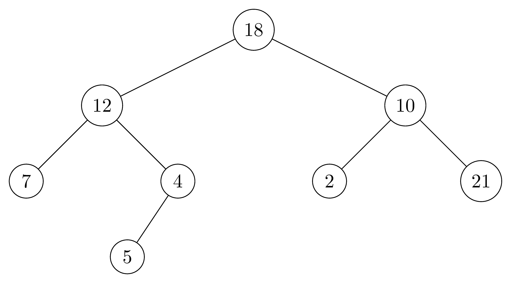

## 10.4-1

> Draw the binary tree rooted at index $6$ that is represented by the following attributes:
>
> $$
> \begin{array}{cccc}
> \text{index} & key & left & right \\\\
> \hline
>  1 & 12 &  7         &  3         \\\\
>  2 & 15 &  8         & \text{NIL} \\\\
>  3 &  4 & 10         & \text{NIL} \\\\
>  4 & 10 &  5         &  9         \\\\
>  5 &  2 & \text{NIL} & \text{NIL} \\\\
>  6 & 18 &  1         &  4         \\\\
>  7 &  7 & \text{NIL} & \text{NIL} \\\\
>  8 & 14 &  6         &  2         \\\\
>  9 & 21 & \text{NIL} & \text{NIL} \\\\
> 10 &  5 & \text{NIL} & \text{NIL}
> \end{array}
> $$



## 10.4-2

> Write an $O(n)$-time recursive procedure that, given an $n$-node binary tree, prints out the key of each node in the tree.

```cpp
PRINT-BINARY-TREE(T)
    x = T.root
    if x != NIL
        PRINT-BINARY-TREE(x.left)
        print x.key
        PRINT-BINARY-TREE(x.right)
```

## 10.4-3

> Write an O$(n)$-time nonrecursive procedure that, given an $n$-node binary tree, prints out the key of each node in the tree. Use a stack as an auxiliary data structure.

```cpp
PRINT-BINARY-TREE(T, S)
    PUSH(S, T.root)
    while !STACK-EMPTY(S)
        x = S[S.top]
        while x != NIL      // store all nodes on the path towards the leftmost leaf
            PUSH(S, x.left)
            x = S[S.top]
        POP(S)              // S has NIL on its top, so pop it
        if !STACK-EMPTY(S)  // print this nodes, leap to its in-order successor
            x = POP(S)
            print x.key
            PUSH(S, x.right)
```

## 10.4-4

> Write an $O(n)$-time procedure that prints all the keys of an arbitrary rooted tree with $n$ nodes, where the tree is stored using the left-child, right-sibling representation.

```cpp
PRINT-LCRS-TREE(T)
    x = T.root
    if x != NIL
        print x.key
        lc = x.left-child
        if lc != NIL
            PRINT-LCRS-TREE(lc)
            rs = lc.right-sibling
            while rs != NIL
                PRINT-LCRS-TREE(rs)
                rs = rs.right-sibling
```

## 10.4-5 $\star$

> Write an $O(n)$-time nonrecursive procedure that, given an $n$-node binary tree, prints out the key of each node. Use no more than constant extra space outside of the tree itself and do not modify the tree, even temporarily, during the procedure.

```cpp
PRINT-KEY(T)
    prev = NIL
    x = T.root
    while x != NIL
        if prev = x.parent
            print x.key
            if x == x.left
                x.left
            else
                if x.right
                    x.right
                else x.parent
            else if prev == x.left and x.left != NIL
                prev = x
                x = x.right
            else
                prev = x
                x = x.parent
```

## 10.4-6 $\star$

> The left-child, right-sibling representation of an arbitrary rooted tree uses three pointers in each node: _left-child_, _right-sibling_, and _parent_. From any node, its parent can be reached and identified in constant time and all its children can be reached and identified in time linear in the number of children. Show how to use only two pointers and one boolean value in each node so that the parent of a node or all of its children can be reached and identified in time linear in the number of children.

Use boolean to identify the last sibling, and the last sibling's right-sibling points to the parent.
