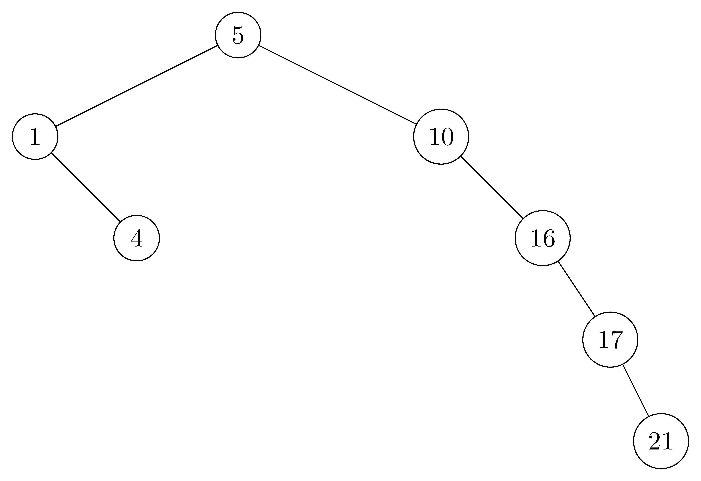
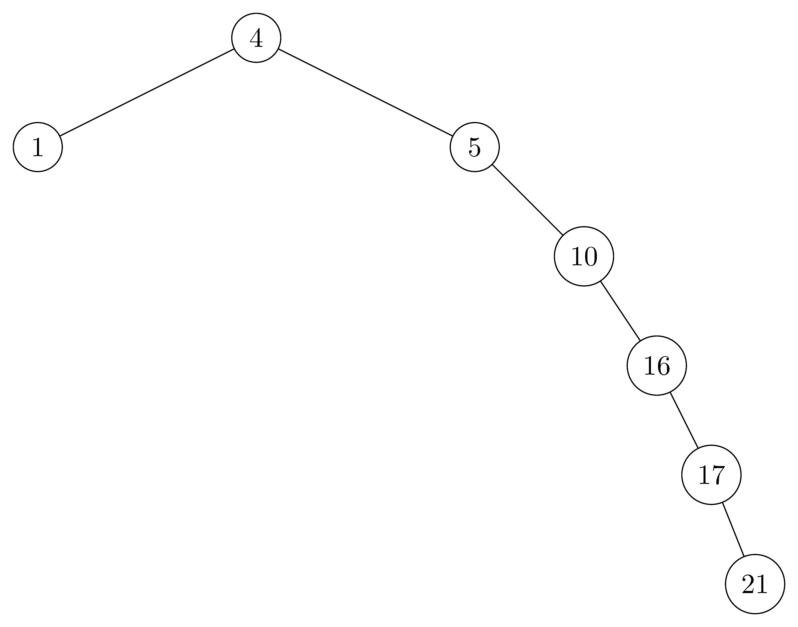

## 12.1-1

> For the set of $\\{ 1, 4, 5, 10, 16, 17, 21 \\}$ of keys, draw binary search trees of heights $2$, $3$, $4$, $5$, and $6$.

- $height = 2$:

  

- $height = 3$:

  

- $height = 4$:

  

- $height = 5$:

  

- $height = 6$:

  

## 12.1-2

> What is the difference between the binary-search-tree property and the min-heap property (see page 153)? Can the min-heap property be used to print out the keys of an $n$-node tree in sorted order in $O(n)$ time? Show how, or explain why not.

- The binary-search-tree property guarantees that all nodes in the left subtree are smaller, and all nodes in the right subtree are larger.
- The min-heap property only guarantees the general child-larger-than-parent relation, but doesn't distinguish between left and right children. For this reason, the min-heap property can't be used to print out the keys in sorted order in linear time because we have no way of knowing which subtree contains the next smallest element.

## 12.1-3

> Give a nonrecursive algorithm that performs an inorder tree walk. ($\textit{Hint:}$ An easy solution uses a stack as an auxiliary data structure. A more complicated, but elegant, solution uses no stack but assumes that we can test two pointers for equality.)

```cpp
INORDER-TREE-WALK(T)
    let S be an empty stack
    current = T.root
    done = 0
    while !done
        if current != NIL
            PUSH(S, current)
            current = current.left
        else
            if !S.EMPTY()
                current = POP(S)
                print current
                current = current.right
            else done = 1
```

## 12.1-4

> Give recursive algorithms that perform preorder and postorder tree walks in $\Theta(n)$ time on a tree of $n$ nodes.

```cpp
PREORDER-TREE-WALK(x)
    if x != NIL
        print x.key
        PREORDER-TREE-WALK(x.left)
        PREORDER-TREE-WALK(x.right)
```

```cpp
POSTORDER-TREE-WALK(x)
    if x != NIL
        POSTORDER-TREE-WALK(x.left)
        POSTORDER-TREE-WALK(x.right)
        print x.key
```

## 12.1-5

> Argue that since sorting $n$ elements takes $\Omega(n\lg n)$ time in the worst case in the comparison model, any comparison-based algorithm for constructing a binary search tree from an arbitrary list of $n$ elements takes $\Omega(n\lg n)$ time in the worst case.

Assume, for the sake of contradiction, that we can construct the binary search tree by comparison-based algorithm using less than $\Omega(n\lg n)$ time, since the inorder tree walk is $\Theta(n)$, then we can get the sorted elements in less than $\Omega(n\lg n)$ time, which contradicts the fact that sorting $n$ elements takes $\Omega(n\lg n)$ time in the worst case.
