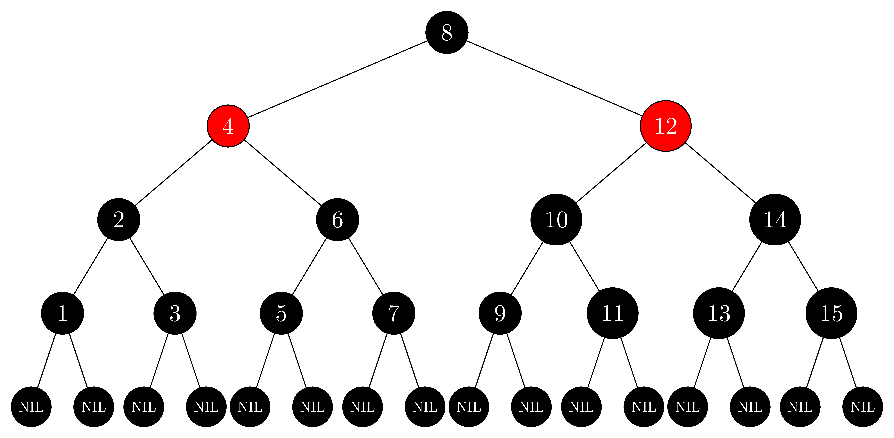

## 13.1-1

> In the style of Figure 13.1(a), draw the complete binary search tree of height $3$ on the keys $\\{1, 2, \ldots, 15\\}$. Add the $\text{NIL}$ leaves and color the nodes in three different ways such that the black-heights of the resulting red-black trees are $2$, $3$, and $4$.

- Complete binary tree of $height = 3$:

  

- Red-black tree of $black\text-heights = 2$:

  

- Red-black tree of $black\text-heights = 3$:

  

- Red-black tree of $black\text-heights = 4$:

  

## 13.1-2

> Draw the red-black tree that results after $\text{TREE-INSERT}$ is called on the tree in Figure 13.1 with key $36$. If the inserted node is colored red, is the resulting tree a red-black tree? What if it is colored black?

- If the inserted node is colored red, the tree doesn't satisfy property 4 because $35$ will be the parent of $36$, which is also colored red.
- If the inserted node is colored black, the tree doesn't satisfy property 5 because there will be two paths from node $38$ to $T.nil$ which contain different numbers of black nodes.

We don't draw the _wrong_ red-black tree; however, we draw the adjusted correct tree:

## 13.1-3

> Let us define a **_relaxed red-black tree_** as a binary search tree that satisfies red-black properties 1, 3, 4, and 5. In other words, the root may be either red or black. Consider a relaxed red-black tree $T$ whose root is red. If we color the root of $T$ black but make no other changes to $T$, is the resulting tree a red-black tree?

Yes, it is.

- Property 1 is trivially satisfied since only one node is changed and it is not changed to some mysterious third color.
- Property 3 is trivially satisfied since no new leaves are introduced.
- Property 4 is satisfied since there was no red node introduced, and root is in every path from the root to the leaves, but no others.
- Property 5 is satisfied since the only paths we will be changing the number of black nodes in are those coming from the root. All of these will increase by $1$, and so will all be equal.

## 13.1-4

> Suppose that we "absorb" every red node in a red-black tree into its black parent, so that the children of the red node become children of the black parent. (Ignore what happens to the keys.) What are the possible degrees of a black node after all its red children are absorbed? What can you say about the depths of the leaves of the resulting tree?

The possible degrees are $0$ through $5$, based on whether or not the black node was a root and whether it had one or two red children, each with either one or two black children. The depths could shrink by at most a factor of $1 / 2$.

## 13.1-5

> Show that the longest simple path from a node $x$ in a red-black tree to a descendant leaf has length at most twice that of the shortest simple path from node $x$ to a descendant leaf.

Suppose we have the longest simple path $(a_1, a_2, \dots, a_s)$ and the shortest simple path $(b_1, b_2, \dots, b_t)$. Then, by property 5 we know they have equal numbers of black nodes. By property 4, we know that neither contains a repeated red node. This tells us that at most $\left\lfloor \frac{s - 1}{2} \right\rfloor$ of the nodes in the longest path are red. This means that at least $\left\lceil \frac{s + 1}{2} \right\rceil$ are black, so, $t \le \left\lceil \frac{s + 1}{2} \right\rceil$. Therefore, if, by way of contradiction, we had that $s > t \cdot 2$, then $t \ge \left\lceil \frac{s + 1}{2} \right\rceil \ge \left\lceil \frac{2t + 2}{2} \right\rceil = t + 1$ results a contradiction.

## 13.1-6

> What is the largest possible number of internal nodes in a red-black tree with black-height $k$? What is the smallest possible number?

- The largest is a path with half black nodes and half red nodes, which has $2^{2k} - 1$ internal nodes.
- The smallest is a path with all black nodes, which has $2^k - 1$ internal nodes.

## 13.1-7

> Describe a red-black tree on $n$ keys that realizes the largest possible ratio of red internal nodes to black internal nodes. What is this ratio? What tree has the smallest possible ratio, and what is the ratio?

- The largest ratio is $2$, each black node has two red children.
- The smallest ratio is $0$.
