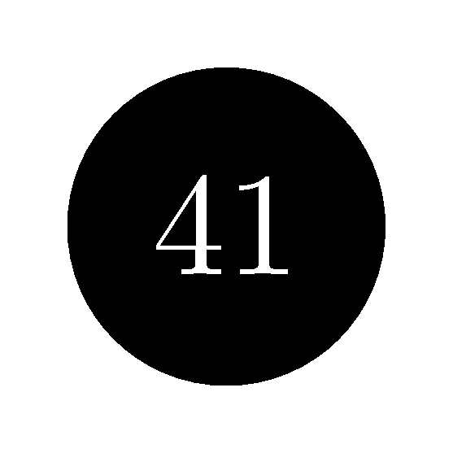
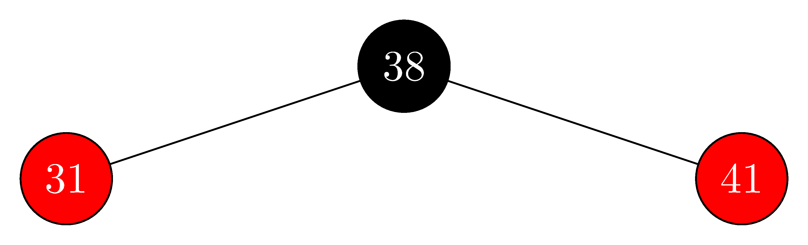
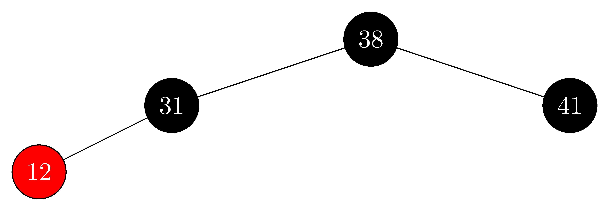
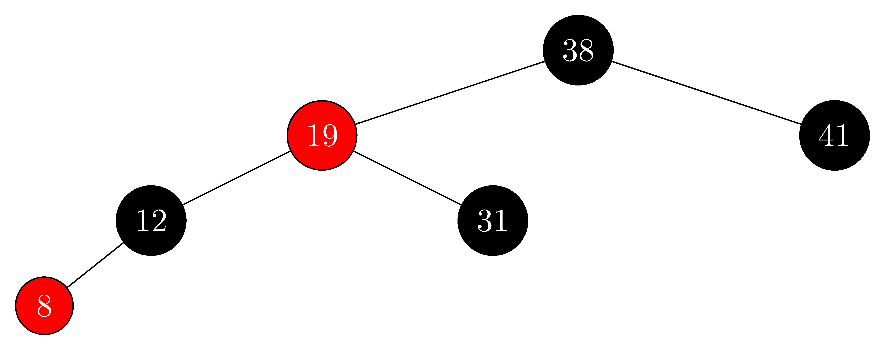
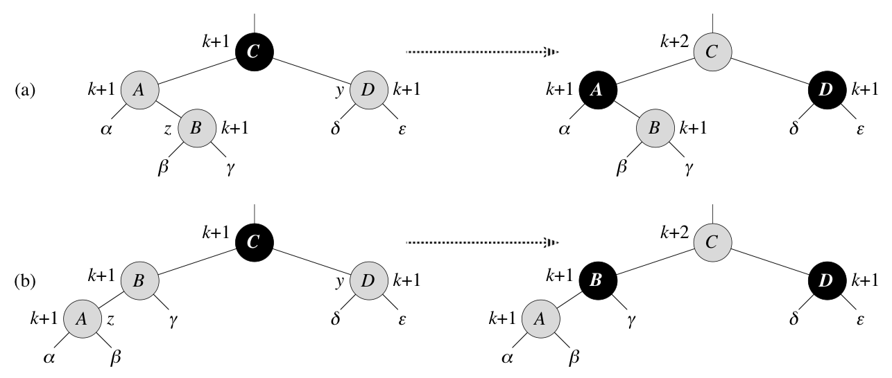
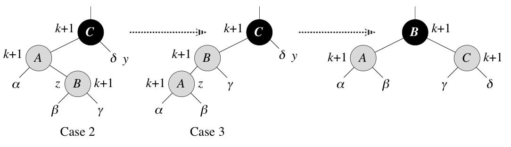

## 13.3-1

> In line 16 of $\text{RB-INSERT}$, we set the color of the newly inserted node $z$ to red. Observe that if we had chosen to set $z$'s color to black, then property 4 of a red-black tree would not be violated. Why didn't we choose to set $z$'s color to black?

If we chose to set the color of $z$ to black then we would be violating property 5 of being a red-black tree. Because any path from the root to a leaf under $z$ would have one more black node than the paths to the other leaves.

## 13.3-2

> Show the red-black trees that result after successively inserting the keys $41, 38, 31, 12, 19, 8$ into an initially empty red-black tree.

- insert $41$:

    

- insert $38$:

    

- insert $31$:

    

- insert $12$:

    

- insert $19$:

    

- insert $8$:

    

## 13.3-3

> Suppose that the black-height of each of the subtrees $\alpha, \beta, \gamma, \delta, \epsilon$ in Figures 13.5 and 13.6 is $k$. Label each node in each figure with its black-height to verify that the indicated transformation preserves property 5.

In Figure 13.5, nodes $A$, $B$, and $D$ have black-height $k + 1$ in all cases, because each of their subtrees has black-height $k$ and a black root. Node $C$ has black-height $k + 1$ on the left (because its red children have black-height $k + 1$) and black-height $k + 2$ on the right (because its black children have black-height $k + 1$).

In Figure 13.6, nodes $A$, $B$, and $C$ have black-height $k + 1$ in all cases. At left and in the middle, each of $A$'s and $B$'s subtrees has black-height $k$ and a black root, while $C$ has one such subtree and a red child with black-height $k + 1$. At the right, each of $A$'s and $C$'s subtrees has black-height $k$ and a black root, while $B$'s red children each have black-height $k + 1$.

Property 5 is preserved by the transformations. We have shown above that the black-height is well-defined within the subtrees pictured, so property 5 is preserved within those subtrees. Property 5 is preserved for the tree containing the subtrees pictured, because every path through these subtrees to a leaf contributes $k + 2$ black nodes.

## 13.3-4

> Professor Teach is concerned that $\text{RB-INSERT-FIXUP}$ might set $T.nil.color$ to $\text{RED}$, in which case the test in line 1 would not cause the loop to terminate when $z$ is the root. Show that the professor's concern is unfounded by arguing that $\text{RB-INSERT-FIXUP}$ never sets $T.nil.color$ to $\text{RED}$.

Colors are set to red only in cases 1 and 3, and in both situations, it is $z.p.p$ that is reddened. If $z.p.p$ is the sentinel, then $z.p$ is the root. By part (b) of the loop invariant and line 1 of $\text{RB-INSERT-FIXUP}$, if $z.p$ is the root, then we have dropped out of the loop. The only subtlety is in case 2, where we set $z = z.p$ before coloring $z.p.p$ red. Because we rotate before the recoloring, the identity of $z.p.p$ is the same before and after case 2, so there's no problem.

## 13.3-5

> Consider a red-black tree formed by inserting $n$ nodes with $\text{RB-INSERT}$. Argue that if $n > 1$, the tree has at least one red node.

- **Case 1:** $z$ and $z.p.p$ are $\text{RED}$, if the loop terminates, then $z$ could not be the root, thus $z$ is $\text{RED}$ after the fix up.
- **Case 2:** $z$ and $z.p$ are $\text{RED}$, and after the rotation $z.p$ could not be the root, thus $z.p$ is $\text{RED}$ after the fix up.
- **Case 3:** $z$ is $\text{RED}$ and $z$ could not be the root, thus $z$ is $\text{RED}$ after the fix up.

Therefore, there is always at least one red node.

## 13.3-6

> Suggest how to implement $\text{RB-INSERT}$ efficiently if the representation for red-black trees includes no storage for parent pointers.

Use stack to record the path to the inserted node, then parent is the top element in the stack.

- **Case 1:** we pop $z.p$ and $z.p.p$.
- **Case 2:** we pop $z.p$ and $z.p.p$, then push $z.p.p$ and $z$.
- **Case 3:** we pop $z.p$, $z.p.p$ and $z.p.p.p$, then push $z.p$.
