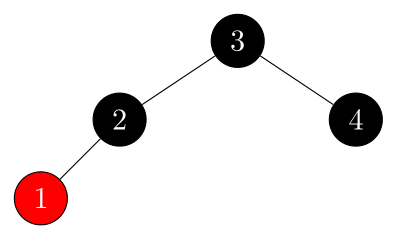

## 13.4-1

> Argue that after executing $\text{RB-DELETE-FIXUP}$, the root of the tree must be black.

- **Case 1:** transform to 2, 3, 4.
- **Case 2:** if terminates, the root of the subtree (the new $x$) is set to black.
- **Case 3:** transform to 4.
- **Case 4:** the root (the new $x$) is set to black.

## 13.4-2

> Argue that if in $\text{RB-DELETE}$ both $x$ and $x.p$ are red, then property 4 is restored by the call to $\text{RB-DELETE-FIXUP}(T, x)$.

Suppose that both $x$ and $x.p$ are red in $\text{RB-DELETE}$. This can only happen
in the else-case of line 9. Since we are deleting from a red-black tree, the other child of y.p which becomes $x$'s sibling in the call to $\text{RB-TRANSPLANT}$ on line 14 must be black, so $x$ is the only child of $x.p$ which is red. The while-loop condition of $\text{RB-DELETE-FIXUP}(T, x)$ is immediately violated so we simply set $x.color = black$, restoring property 4.

## 13.4-3

> In Exercise 13.3-2, you found the red-black tree that results from successively inserting the keys $41, 38, 31, 12, 19, 8$ into an initially empty tree. Now show the red-black trees that result from the successive deletion of the keys in the order $8, 12, 19, 31, 38, 41$.

- initial:

    

- delete $8$:

    

- delete $12$:

    

- delete $19$:

    

- delete $31$:

    

- delete $38$:

    

- delete $41$:

    

## 13.4-4

> In which lines of the code for $\text{RB-DELETE-FIXUP}$ might we examine or modify the sentinel $T.nil$?

When the node $y$ in $\text{RB-DELETE}$ has no children, the node $x = T.nil$, so we'll examine the line 2 of $\text{RB-DELETE-FIXUP}$.

When the root node is deleted, $x = T.nil$ and the root at this time is $x$, so the line 23 of $\text{RB-DELETE-FIXUP}$ will draw $x$ to black.

## 13.4-5

> In each of the cases of Figure 13.7, give the count of black nodes from the root of the subtree shown to each of the subtrees $\alpha, \beta, \ldots, \zeta$, and verify that each count remains the same after the transformation. When a node has a $color$ attribute $c$ or $c'$, use the notation $\text{count}\(c\)$ or $\text{count}(c')$ symbolically in your count.

Our count will include the root (if it is black).

- **Case 1:** For each subtree, it is $2$ both before and after.

- **Case 2:**

    - For $\alpha$ and $\beta$, it is $1 + \text{count}\(c\)$ in both cases.
    - For the rest of the subtrees, it is from $2 + \text{count}\(c\)$ to $1 + \text{count}\(c\)$.

    This decrease in the count for the other subtreese is handled by then having $x$ represent an additional black.

- **Case 3:**

    - For $\epsilon$ and $\zeta$, it is $2+\text{count}\(c\)$ both before and after.
    - For all the other subtrees, it is $1+\text{count}\(c\)$ both before and after.

- **Case 4:**

    - For $\alpha$ and $\beta$, it is from $1 + \text{count}\(c\)$ to $2 + \text{count}\(c\)$.
    - For $\gamma$ and $\delta$, it is $1 + \text{count}\(c\) + \text{count}(c')$ both before and after.
    - For $\epsilon$ and $\zeta$, it is $1 + \text{count}\(c\)$ both before and after.

This increase in the count for $\alpha$ and $\beta$ is because $x$ before indicated an extra black.

## 13.4-6

> Professors Skelton and Baron are concerned that at the start of case 1 of $\text{RB-DELETE-FIXUP}$, the node $x.p$ might not be black. If the professors are correct, then lines 5–6 are wrong. Show that $x.p$ must be black at the start of case 1, so that the professors have nothing to worry about.

At the start of case 1 we have set $w$ to be the sibling of $x$. We check on line 4 that $w.color == red$, which means that the parent of $x$ and $w$ cannot be red. Otherwise property 4 is violated. Thus, their concerns are unfounded.

## 13.4-7

> Suppose that a node $x$ is inserted into a red-black tree with $\text{RB-INSERT}$ and then is immediately deleted with $\text{RB-DELETE}$. Is the resulting red-black tree the same as the initial red-black tree? Justify your answer.

No, the red-black tree will not necessarily be the same.

- Example 1:

    - initial:

        

    - insert $1$:

        

    - delete $1$:

        

- Example 2:

    - initial:

        

    - insert $1$:

        

    - delete $1$:

        
