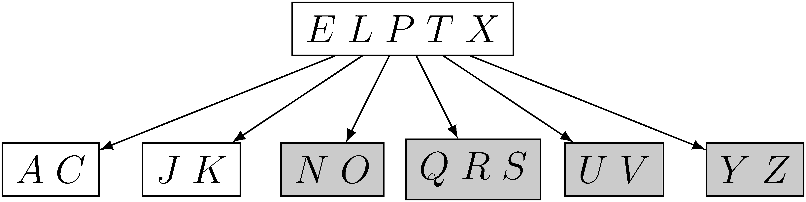
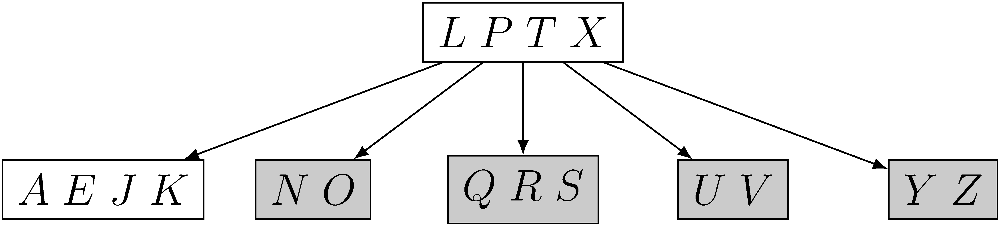
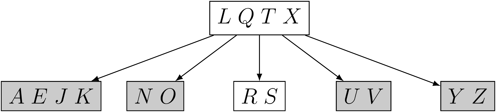
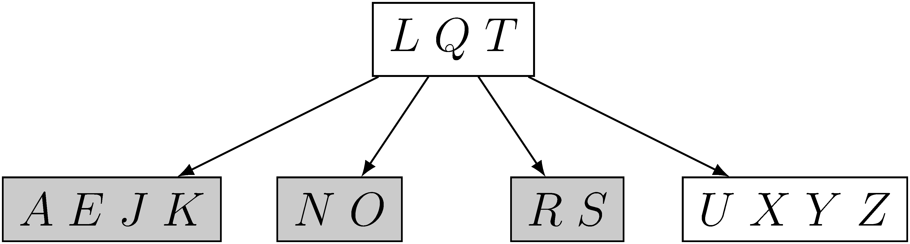

## 18.3-1

> Show the results of deleting $C$, $P$, and $V$, in order, from the tree of Figure 18.8(f).

- Figure 18.8(f)

    

- delete $C$

    

- delete $P$

    

- delete $V$

    

## 18.3-2

> Write pseudocode for $\text{B-TREE-DELETE}$.

The algorithm $\text{B-TREE-DELETE}(x, k)$ is a recursive procedure which deletes key $k$ from the B-tree rooted at node $x$.

The functions $\text{PREDECESSOR}(k, x)$ and $\text{SUCCESSOR}(k, x)$ return the predecessor and successor of $k$ in the B-tree rooted at $x$ respectively.

The cases where $k$ is the last key in a node have been omitted because the pseudocode is already unwieldy. For these, we simply use the left sibling as opposed to the right sibling, making the appropriate modifications to the indexing in the **for** loops.
