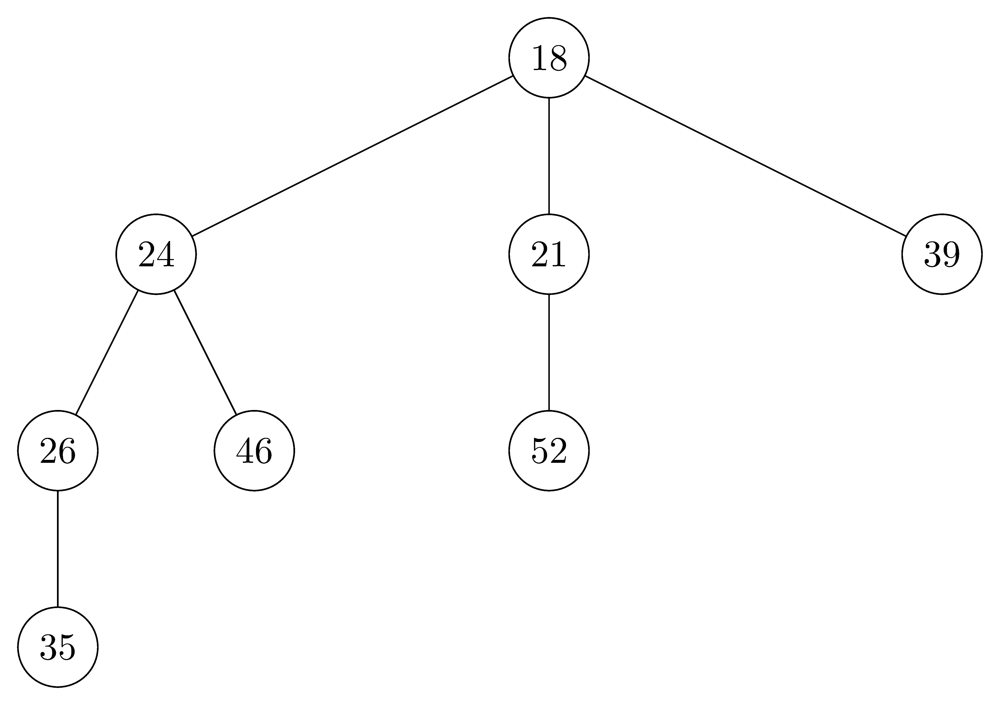

## 21.3-1

> Redo Exercise 21.2-2 using a disjoint-set forest with union by rank and path compression.

## 21.3-2

> Write a nonrecursive version of $\text{FIND-SET}$ with path compression.

To implement $\text{FIND-SET}$ nonrecursively, let $x$ be the element we call the function on. Create a linked list $A$ which contains a pointer to $x$. Each time we most one element up the tree, insert a pointer to that element into $A$. Once the root $r$ has been found, use the linked list to find each node on the path from the root to $x$ and update its parent to $r$.

## 21.3-3

> Give a sequence of $m$ $\text{MAKE-SET}$, $\text{UNION}$, and $\text{FIND-SET}$ operations, $n$ of which are $\text{MAKE-SET}$ operations, that takes $\Omega(m\lg n)$ time when we use union by rank only.

(Removed)

## 21.3-4

> Suppose that we wish to add the operation $\text{PRINT-SET}(x)$, which is given a node $x$ and prints all the members of $x$'s set, in any order. Show how we can add just a single attribute to each node in a disjoint-set forest so that $\text{PRINT-SET}(x)$ takes time linear in the number of members of $x$'s set and the asymptotic running times of the other operations are unchanged. Assume that we can print each member of the set in $O(1)$ time.

(Removed)

## 21.3-5 $\star$

> Show that any sequence of $m$ $\text{MAKE-SET}$, $\text{FIND-SET}$, and $\text{LINK}$ operations, where all the $\text{LINK}$ operations appear before any of the $\text{FIND-SET}$ operations, takes only $O(m)$ time if we use both path compression and union by rank. What happens in the same situation if we use only the path-compression heuristic?

(Removed)
