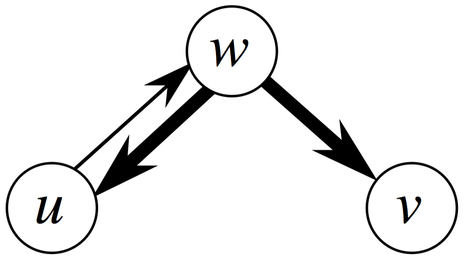
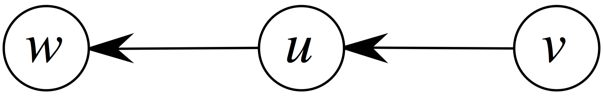

## 22.3-1

> Make a $3$-by-$3$ chart with row and column labels $\text{WHITE}$, $\text{GRAY}$, and $\text{BLACK}$. In each cell $(i, j)$, indicate whether, at any point during a depth-first search of a directed graph, there can be an edge from a vertex of color $i$ to a vertex of color $j$. For each possible edge, indicate what edge types it can be. Make a second such chart for depth-first search of an undirected graph.

According to Theorem 22.7, there are 3 cases of relationship between interval of vertex $u$ and $v$, $u.interval \subset v.interval$, $v.interval \subset u.interval$, and $u.interval$ is detached from $u.interval$. We judge the possibility according to this Theorem.

- For Directed Graph:

    1. $\text{BLACK}$ to $\text{BLACK}$ and $\text{WHITE}$ to $\text{WHITE}$ works with everything, we omit this two later.
    2. For Cross Edge $(u, v)$, we must have $v.d < v.f < u.d < u.f$, then it could be $\text{WHITE}$ to $\text{BLACK}$, $\text{WHITE}$ to $\text{GRAY}$ and $\text{GRAY}$ to $\text{BLACK}$.
    3. For Tree Edge and Forward Edge $(u, v)$, we must have $u.d < v.d < v.f < u.f$, then it could be $\text{GRAY}$ to $\text{WHITE}$, $\text{GRAY}$ to $\text{GRAY}$ and $\text{GRAY}$ to $\text{BLACK}$.
    4. For Back Edge $(u, v)$, we must have $v.d < u.d < u.f < v.f$, then it could be $\text{WHITE}$ to $\text{GRAY}$, $\text{GRAY}$ to $\text{GRAY}$ and $\text{BLACK}$ to $\text{GRAY}$.

    $$
    \begin{array}{c|ccc}
    from\backslash to & \text{BLACK}                & \text{GRAY}                & \text{WHITE} \\\\
    \hline
    \text{BLACK}      & \text{Allkinds}             & \text{Back}                & - \\\\
    \text{GRAY}       & \text{Tree, Forward, Cross} & \text{Tree, Forward, Back} & \text{Tree, Forward} \\\\
    \text{WHITE}      & \text{Cross}                & \text{Cross, Back}         & \text{Allkinds}
    \end{array}
    $$

- For Undirected Graph, starting from Directed Chart, we remove the Forward Edge and Cross Edge, and when a Back Edge exist, we add Tree Edge; when a Tree Edge exist, we add Back Edge. This is correct for following reason:

    1. Theorem 22.10: In a depth-first search of an undirected graph $G$, every edge of $G$ is either a tree edge or a back edge. So Tree edge and back edge only.
    2. If $(u, v)$ is a Tree edge from $u$'s perspective, $(u, v)$ is also a Back Edge from $v$'s perspective.

    $$
    \begin{array}{c|ccc}
    from\backslash to & \text{BLACK}      & \text{GRAY}       & \text{WHITE} \\\\
    \hline
    \text{BLACK}      & \text{Tree, Back} & \text{Tree, Back} & - \\\\
    \text{GRAY}       & \text{Tree, Back} & \text{Tree, Back} & \text{Tree, Back} \\\\
    \text{WHITE}      & -                 & \text{Tree, Back} & \text{Tree, Back}
    \end{array}
    $$

## 22.3-2

> Show how depth-first search works on the graph of Figure 22.6. Assume that the **for** loop of lines 5–7 of the $\text{DFS}$ procedure considers the vertices in alphabetical order, and assume that each adjacency list is ordered alphabetically. Show the discovery and finishing times for each vertex, and show the classification of each edge.

The following table gives the discovery time and finish time for each vetex in the graph.

$$
\begin{array}{ccc}
\text{Vertex} & \text{Discovered} & \text{Finished} \\\\
\hline
q &  1 & 16 \\\\
r & 17 & 20 \\\\
s &  2 &  7 \\\\
t &  8 & 15 \\\\
u & 18 & 19 \\\\
v &  3 &  6 \\\\
w &  4 &  5 \\\\
x &  9 & 12 \\\\
y & 13 & 14 \\\\
z & 10 & 11
\end{array}
$$

- **Tree edges:** $(q, s)$, $(s, v)$, $(v, w)$, $(q, t)$, $(t, x)$, $(x, z)$, $(t, y)$, $(r, u)$.
- **Back edges:** $(w, s)$, $(z, x)$, $(y, q)$.
- **Forward edges:** $(q, w)$.
- **Cross edges:** $(r, y)$, $(u, y)$.

## 22.3-3

> Show the parenthesis structure of the depth-first search of Figure 22.4.

As pointed out in figure 22.5, the parentheses structure of the $\text{DFS}$ of figure 22.4 is $(((())()))(()())$.

## 22.3-4

> Show that using a single bit to store each vertex color suffices by arguing that the $\text{DFS}$ procedure would produce the same result if line 3 of $\text{DFS-VISIT}$ was removed.

$\textit{Note:}$ This exercise changed in the third printing. This solution reflects the change.

The $\text{DFS}$ and $\text{DFS-VISIT}$ procedures care only whether a vertex is white or not. By coloring vertex $u$ gray when it is first visited, in line 3 of $\text{DFS-VISIT}$, we ensure that $u$ will not be visited again. Once we have changed a vertex's color to non-white, we do not need to change it again.

## 22.3-5

> Show that edge $(u, v)$ is
>
> **a.** a tree edge or forward edge if and only if $u.d < v.d < v.f < u.f$,
>
> **b.** a back edge if and only if $v.d \le u.d < u.f \le v.f$, and
>
> **c.** a cross edge if and only if $v.d < v.f < u.d < u.f$.

**a.** Edge $(u, v)$ is a tree edge or forward edge if and only if $v$ is a descendant of $u$ in the depth-first forest. (If $(u, v)$ is a back edge, then $u$ is a descendant of $v$, and if $(u, v)$ is a cross edge, then neither of $u$ or $v$ is a descendant of the other.) By Corollary 22.8, therefore, $(u, v)$ is a tree edge or forward edge if and only if $u.d < v.d < v.f < u.f$.

**b.** First, suppose that $(u, v)$ is a back edge. A self-loop is by definition a back edge. If $(u, v)$ is a self-loop, then clearly $v.d = u.d < u.f = v.f$. If $(u, v)$ is not a self-loop, then $u$ is a descendant of $v$ in the depth-first forest, and by Corollary 22.8, $v.d < u.d < u.f < v.f$.

Now, suppose that $v.d \le u.d < u.f \le v.f$. If $u$ and $v$ are the same vertex, then $v.d = u.d < u.f = v.f$, and $(u, v)$ is a self-loop and hence a back edge. If $u$ and $v$ are distinct, then $v.d < u.d < u.f < v.f$. By the parenthesis theorem, interval $[u.d, u.f]$ is contained entirely within the interval $[v.d, v.f]$, and $u$ is a descendant of $v$ in a depth-first tree. Thus, $(u, v)$ is a back edge.

**c.** First, suppose that $(u, v)$ is a cross edge. Since neither $u$ nor $v$ is an ancestor of the other, the parenthesis theorem says that the intervals $[u.d, u.f]$ and $[v.d, v.f]$ are entirely disjoint. Thus, we must have either $u.d < u.f < v.d < v.f$ or $v.d < v.f < u.d < u.f$. We claim that we cannot have $u.d < v.d$ if $(u, v)$ is a cross edge. Why? If $u.d < v.d$, then $v$ is white at time $u.d$. By the white-path theorem, $v$ is a descendant of $u$, which contradicts $(u, v)$ being a cross edge. Thus, we must have $v.d < v.f < u.d < u.f$.

Now suppose that $v.d < v.f < u.d < u.f$. By the parenthesis theorem, neither $u$ nor $v$ is a descendant of the other, which means that $(u, v)$ must be a cross edge.

## 22.3-6

> Show that in an undirected graph, classifying an edge $(u, v)$ as a tree edge or a back edge according to whether $(u, v)$ or $(v, u)$ is encountered first during the depth-first search is equivalent to classifying it according to the ordering of the four types in the classification scheme.

By Theorem 22.10, every edge of an undirected graph is either a tree edge or a back edge. First suppose that $v$ is first discovered by exploring edge $(u, v)$. Then by definition, $(u, v)$ is a tree edge. Moreover, $(u, v)$ must have been discovered before $(v, u)$ because once $(v, u)$ is explored, $v$ is necessarily discovered. Now suppose that $v$ isn't first discovered by $(u, v)$. Then it must be discovered by $(r, v)$ for some $r\ne u$. If $u$ hasn't yet been discovered then if $(u, v)$ is explored first, it must be a back edge since $v$ is an ancestor of $u$. If $u$ has been discovered then $u$ is an ancestor of $v$, so $(v, u)$ is a back edge.

## 22.3-7

> Rewrite the procedure $\text{DFS}$, using a stack to eliminate recursion.

See the algorithm $\text{DFS-STACK}(G)$. Note that by a similar justification to 22.2-3, we may remove line 8 from the original $\text{DFS-VISIT}$ algorithm without changing the final result of the program, that is just working with the colors white and gray.

## 22.3-8

> Give a counterexample to the conjecture that if a directed graph $G$ contains a path from $u$ to $v$, and if $u.d < v.d$ in a depth-first search of $G$, then $v$ is a descendant of $u$ in the depth-first forest produced.

Let us consider the example graph depth-first search below.

$$
\begin{array}{c|cc}
  & d & f \\\\
\hline
w & 1 & 6 \\\\
u & 2 & 3 \\\\
v & 4 & 5
\end{array}
$$



Clearly, there is a path from $u$ to $v$ in $G$. The bold edges are in the depth-first forest produced. We can see that $u.d < v.d$ in the depth-first search but $v$ is not a descendant of $u$ in the forest.

## 22.3-9

> Give a counterexample to the conjecture that if a directed graph $G$ contains a path from $u$ to $v$, then any depth-first search must result in $v.d \le u.f$.

Let us consider the example graph depth-first search below.

$$
\begin{array}{c|cc}
  & d & f \\\\
\hline
w & 1 & 6 \\\\
u & 2 & 3 \\\\
v & 4 & 5
\end{array}
$$


Clearly, there is a path from $u$ to $v$ in $G$. The bold edges are in the depth-first forest produced by search. However, $v.d > u.f$ and the conjecture is false.

## 22.3-10

> Modify the pseudocode for depth-first search so that it prints out every edge in the directed graph $G$, together with its type. Show what modifications, if any, you need to make if $G$ is undirected.

We need only update $\text{DFS-VISIT}$. If $G$ is undirected we don't need to make any modifications. We simply note that lines 11 through 16 will never be executed.

```cpp
DFS-VISIT-PRINT(G, u)
  time = time + 1
  u.d = time
  u.color = GRAY
  for each v ∈ G.Adj[u]
      if v.color == white
          print "(u, v) is a Tree edge."
          v.π = u
          DFS-VISIT-PRINT(G, v)
      else if v.color == gray
          print "(u, v) is a Back edge."
      else
          if v.d > u.d
              print "(u, v) is a Forward edge."
          else print "(u, v) is a Cross edge."
```

## 22.3-11

> Explain how a vertex $u$ of a directed graph can end up in a depth-first tree containing only $u$, even though $u$ has both incoming and outgoing edges in $G$.

Let us consider the example graph and depth-first search below.

$$
\begin{array}{c|cc}
  & d & f \\\\
\hline
w & 1 & 2 \\\\
u & 3 & 4 \\\\
v & 5 & 6
\end{array}
$$



Cleary $u$ has both incoming and outgoing edges in $G$ but a depth-first search of $G$ produced a depth-first forest where $u$ is in a tree by itself.

## 22.3-12

> Show that we can use a depth-first search of an undirected graph $G$ to identify the connected components of $G$, and that the depth-first forest contains as many trees as $G$ has connected components. More precisely, show how to modify depth-first search so that it assigns to each vertex $v$ an integer label $v.cc$ between $1$ and $k$, where $k$ is the number of connected components of $G$, such that $u.cc = v.cc$ if and only if $u$ and $v$ are in the same connected component.

The following pseudocode modifies the $\text{DFS}$ and $\text{DFS-VISIT}$ procedures to assign values to the $cc$ attributes of vertices.

```cpp
DFS(G)
    for each vertex u ∈ G.V
        u.color = WHITE
        u.π = NIL
    time = 0
    counter = 0
    for each vertex u ∈ G.V
        if u.color == WHITE
            counter = counter + 1
            DFS-VISIT(G, u, counter)
```

```cpp
DFS-VISIT(G, u, counter)
    u.cc = counter      // label the vertex
    time = time + 1
    u.d = time
    u.color = GRAY
    for each v ∈ G.Adj[u]
        if v.color == WHITE
            v.π = u
            DFS-VISIT(G, v, counter)
    u.color = BLACK
    time = time + 1
    u.f = time
```

This $\text{DFS}$ increments a counter each time $\text{DFS-VISIT}$ is called to grow a new tree in the $\text{DFS}$ forest. Every vertex visited (and added to the tree) by $\text{DFS-VISIT}$ is labeled with that same counter value. Thus $u.vv = v.cc$ if and only if $u$ and $v$ are visited in the same call to $\text{DFS-VISIT}$ from $\text{DFS}$, and the final value of the counter is the number of calls that were made to $\text{DFS-VISIT}$ by $\text{DFS}$. Also, since every vertex is visited eventually, every vertex is labeled.

Thus all we need to show is that the vertices visited by each call to $\text{DFS-VISIT}$ from $\text{DFS}$ are exactly the vertices in one connected component of $G$.

- All vertices in a connected component are visited by one call to $\text{DFS-VISIT}$ from $\text{DFS}$:

    Let $u$ be the first vertex in component $C$ visited by $\text{DFS-VISIT}$. Since a vertex becomes non-white only when it is visited, all vertices in $C$ are white when $\text{DFS-VISIT}$ is called for $u$. Thus, by the white-path theorem, all vertices in $C$ become descendants of $u$ in the forest, which means that all vertices in $C$ are visited (by recursive calls to $\text{DFS-VISIT}$) before $\text{DFS-VISIT}$ returns to $\text{DFS}$.

- All vertices visited by one call to $\text{DFS-VISIT}$ from $\text{DFS}$ are in the same connected component:

    If two vertices are visited in the same call to $\text{DFS-VISIT}$ from $\text{DFS}$, they are in the same connected component, because vertices are visited only by following paths in $G$ (by following edges found in adjacency lists, starting from some vertex).

## 22.3-13 $\star$

> A directed graph $G = (V, E)$ is **_singly connected_** if $u \leadsto v$ implies that $G$ contains at most one simple path from $u$ to $v$ for all vertices $u, v \in V$. Give an efficient algorithm to determine whether or not a directed graph is singly connected.

This can be done in time $O(|V||E|)$. To do this, first perform a topological sort of the vertices. Then, we will contain for each vertex a list of it's ancestors with $in\text-degree$ $0$. We compute these lists for each vertex in the order starting from the earlier ones topologically.

Then, if we ever have a vertex that has the same degree $0$ vertex appearing in the lists of two of its immediate parents, we know that the graph is not singly connected. however, if at each step we have that at each step all of the parents have disjoint sets of degree $0$ vertices as ancestors, the graph is singly connected. Since, for each vertex, the amount of time required is bounded by the number of vertices times the $in\text-degree$ of the particular vertex, the total runtime is bounded by $O(|V||E|)$.
